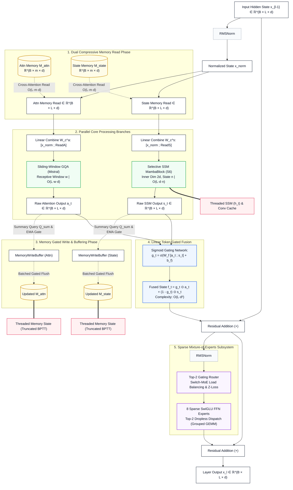

# CustomMistralMamba: Sub-Quadratic Hybrid Mamba–MoE with Dual Compressive Memory

[](https://www.python.org/downloads/)
[](https://pytorch.org/)
[](https://opensource.org/licenses/MIT)
[](https://github.com/astral-sh/ruff)
[](tests/test_model.py)

> **A sub-quadratic causal language model architecture for long-context sequence modeling, integrating sliding-window grouped-query attention, selective state-space models (Mamba S6), dual gated compressive memory banks, and sparse Mixture-of-Experts (MoE) with rigorous empirical falsification protocols.**

---

## Technical Metadata & Reference Summary

| Attribute | Specification |
| :--- | :--- |
| **Author / Lead Researcher** | Vishnu Vardhan |
| **Architectural Revision** | Version 2.1 (Reference Implementation Complete) |
| **Primary Entry Points** | `from model import HybridForCausalLM, HybridMambaMoEConfig, MixtralForCausalLM` |
| **Core Research Document** | [`research/research.md`](research/research.md) |
| **Loss Specification** | [`research/loss-definitions.md`](research/loss-definitions.md) |
| **Package Architecture Reference** | [`model/README.md`](model/README.md) (Comprehensive 24-section developer specification) |
| **Optimization Stack** | Moonshot Muon + AdamW on one GPU; AdamW-only with PyTorch FSDP2 |
| **Scan Acceleration** | 4-Tier Selective Scan (Fused CUDA `mamba-ssm` $\to$ Parallel $\to$ Blocked $\to$ Checkpointed) |
| **Test Suite** | [`tests/test_model.py`](tests/test_model.py) (83 deterministic unit tests, AMP & gradient verified) |

---

## Table of Contents

1. [Abstract & Executive Overview](#1-abstract--executive-overview)
2. [Problem Statement & The Long-Context Trilemma](#2-problem-statement--the-long-context-trilemma)
3. [Core Research Questions & Technical Methodology](#3-core-research-questions--technical-methodology)
4. [System Architecture & Neural Component Breakdown](#4-system-architecture--neural-component-breakdown)
5. [Minimalist Architecture Dataflow Diagram](#5-minimalist-architecture-dataflow-diagram)
6. [Mathematical Formulation & Multi-Task Objectives](#6-mathematical-formulation--multi-task-objectives)
7. [The Write-Path Gradient Starvation Analysis](#7-the-write-path-gradient-starvation-analysis)
8. [Computational Complexity & Parameter Budgeting](#8-computational-complexity--parameter-budgeting)
9. [Training Infrastructure & Distributed Execution](#9-training-infrastructure--distributed-execution)
10. [Inference, Incremental Decoding & State Threading](#10-inference-incremental-decoding--state-threading)
11. [Scientific Validation & Falsification Protocols](#11-scientific-validation--falsification-protocols)
12. [Repository Directory Map](#12-repository-directory-map)
13. [Installation, Verification & Quickstart](#13-installation-verification--quickstart)
14. [Comparative Analysis Against Prior Art](#14-comparative-analysis-against-prior-art)
15. [Limitations & Open Research Roadmap](#15-limitations--open-research-roadmap)
16. [Formal Citation](#16-formal-citation)

---

## 1. Abstract & Executive Overview

Transformer-based autoregressive decoders exhibit quadratic computational complexity $\mathcal{O}(L^2)$ with respect to sequence length $L$, severely restricting their deployment over ultra-long contexts (e.g., $100\text{K}+$ tokens). While linear-time alternatives such as Selective State-Space Models (Mamba / S6) and sliding-window attention dramatically compress computation, they suffer from fundamental information-theoretic limitations: continuous state overwriting introduces severe **recency bias** and degrades the retrieval of non-recurring, long-range facts, while sliding windows induce complete opacity beyond window size $w$.

`CustomMistralMamba` investigates whether introducing **dual, bounded-size, gated compressive memory banks** ($\mathcal{O}(L \cdot m)$ where $m \ll L$) into a hybrid Mamba–Attention–MoE backbone can resolve this trade-off without reintroducing quadratic fusion bottlenecks. The architecture runs sliding-window grouped-query attention (GQA) and a selective state-space model in parallel, conditions both branches on explicit memory states, merges branch outputs via per-token gating ($\mathcal{O}(L \cdot d^2)$), routes through sparse Top-2 Mixture-of-Experts (MoE), and writes raw branch representations back into compressive memory via gated Exponential Moving Average (EMA) updates.

Crucially, rather than treating memory as an untested inductive bias, this repository provides a complete experimental harness with **three strict falsification protocols** designed to prove whether explicit memory provides distinct representational utility over a parameter-matched scale-up of the SSM state.

---

## 2. Problem Statement & The Long-Context Trilemma

Modern language modeling over extended sequence lengths is constrained by three compounding architectural limitations:

```
                      THE LONG-CONTEXT TRILEMMA
                      
                 [1] Quadratic Scaling
                     O(L²) Attention
                          /     \
                         /       \
                        /         \
    [2] Lossy Recurrent State      [3] Uniform Dense Compute
        Overwritten SSM Memory         Fixed FLOPs per Token
```

| Dimension | Mechanism | Failure Mode in Existing Architectures |
| :--- | :--- | :--- |
| **Computational Complexity** | Full Multi-Head Self-Attention requires computing an $L \times L$ pairwise attention matrix $\text{Softmax}\left(\frac{QK^T}{\sqrt{d_k}}\right)V$. | Memory allocation and FLOP requirements grow as $\mathcal{O}(L^2)$, making context scaling beyond $32\text{K}$ tokens computationally prohibitive on standard hardware. |
| **Information Retention** | Pure Recurrent / SSM architectures compress entire token histories into a fixed-size latent state $h_t \in \mathbb{R}^{d_{\text{inner}} \times n}$. | State capacity is bounded. Under continuous sequence evolution, rare, one-off facts presented early are exponentially diluted (recency bias). |
| **Compute Allocation** | Dense Transformer layers apply identical feed-forward networks (FFN) to every token regardless of semantic density. | Computation cannot be dynamically allocated to difficult tokens or specialized semantic domains without scaling total FLOPs quadratically. |

### Limitations of Partial Solutions

* **Mamba / Linear RNNs:** Achieve linear time $\mathcal{O}(L)$ via continuous state updates, but struggle with precise associative retrieval across long token distances due to continuous state overwrite.
* **Sliding-Window Attention (Mistral):** Bounds local attention compute to $\mathcal{O}(L \cdot w)$, but is causally blind to tokens outside the receptive field $[t-w, t]$.
* **Mixture-of-Experts (Mixtral):** Decouples parameter capacity from FLOPs via sparse routing, but does not address sequence-length scaling or memory permanence.
* **Jamba Hybrid:** Composes Mamba, Attention, and MoE layers, but lacks an explicit, queryable, persistent memory store outside the decaying SSM state.

---

## 3. Core Research Questions & Technical Methodology

### Primary Research Hypothesis

> **Hypothesis:** *A sub-quadratic hybrid architecture combining sliding-window GQA, selective state spaces, and Top-2 MoE can achieve robust long-range recall of rare, non-recurring facts by incorporating bounded ($m$ slots), gated compressive memory banks—without incurring quadratic compute $\mathcal{O}(L^2)$ or cross-attention fusion bottlenecks.*

### Methodological Innovations

1. **Sub-Quadratic Layer Formulation:** Every neural component operates in $\mathcal{O}(L)$ time when hyper-parameters ($w, m, n, d$) are held constant.
2. **True Memory Decoupling:** Memory banks are read *before* branch execution (conditioning inputs) and updated *from raw branch outputs* (accumulating newly generated signals), preventing memory from degenerating into a static residual stream bias.
3. **Linear Token-Gated Fusion:** Branch outputs are merged via an elementwise sigmoid gate $\mathcal{O}(L \cdot d^2)$, completely eliminating the $\mathcal{O}(L^2)$ bidirectional cross-attention bottleneck identified in early hybrid proposals.
4. **Direct Auxiliary Write-Path Supervision:** An 8-objective auxiliary loss suite ($\mathcal{L}_{\text{recon}}, \mathcal{L}_{\text{assoc}}, \dots$) provides direct gradient signals to memory write parameters, overcoming truncated BPTT gradient starvation.
5. **Dual-Model Control Architecture:** The repository natively implements two matched model classes (`MixtralForCausalLM` and `HybridForCausalLM`) to enable strict, apples-to-apples empirical ablations.

---

## 4. System Architecture & Neural Component Breakdown

The core building block is the `HybridDecoderLayer`, which coordinates five distinct subsystems:

```
HybridDecoderLayer Pipeline
══════════════════════════════════════════════════════════════════════════════
Input x ──► RMSNorm ──┬──► [Read Attn Bank]  ──► SlidingWindowGQA ──┐
                      └──► [Read State Bank] ──► MambaBlock (SSM) ──┤
                                                                     ▼
                      ┌── Attn Output  ──► Write Attn Bank    Token-Gated
                      └── Mamba Output ──► Write State Bank     Fusion
                                                                     │
                                                                     ▼
Layer Output ◄── Residual ◄── Top-2 MoE ◄── RMSNorm ◄── Residual Add ◄─┘
```

### 1. Sliding-Window Grouped-Query Attention (`SlidingWindowGQA`)
* **Local Receptive Field:** Evaluates scaled dot-product attention (SDPA) strictly over the most recent $w$ tokens ($\mathcal{O}(L \cdot w)$ complexity).
* **Grouped Queries:** Maps $H_q$ query heads to $H_{kv}$ key-value heads ($H_q / H_{kv}$ sharing ratio), reducing KV cache memory footprint.
* **Rotary Position Embeddings (RoPE):** Applied via a shared, fixed-size cache up to `max_position_embeddings`, completely avoiding dynamic buffer reallocations under distributed FSDP execution.
* **Attention Sinks & QK-Norm:** Supports optional StreamingLLM-style initial sink tokens (`num_sink_tokens`) and per-head RMS normalization prior to rotation (`use_qk_norm`).

### 2. Selective State-Space Branch (`MambaBlock`)
* **Continuous-to-Discrete Selective SSM:** Parameterizes input-dependent $\Delta, B, C$ matrices over inner dimension $d_{\text{inner}} = E_{\text{mamba}} \cdot d$:
  $$\Delta = \text{Softplus}\left(\text{Linear}_{\Delta}(x) + b_{\Delta}\right), \quad \bar{A} = \exp(\Delta A), \quad \bar{B} = \Delta B$$
  $$h_t = \bar{A}_t h_{t-1} + \bar{B}_t u_t, \quad y_t = C_t h_t + D u_t$$
* **Multi-Tier Execution Dispatch:**
  * **Tier 1 (Fused CUDA):** Direct binding to `mamba-ssm` selective scan kernels for maximum throughput.
  * **Tier 1b (Unpadded Fused):** Vectorized per-row unpadded scan with autograd-safe tensor reconstruction for padded batches.
  * **Tier 2 (Parallel Scan):** Pure PyTorch Hillis–Steele associative scan for sequences $L \le 4096$.
  * **Tier 3 (Blocked Scan):** Chunk-vectorized scan (chunk size 256) for $4096 < L \le 65536$.
  * **Tier 4 (Sequential Checkpointed Scan):** Minimal-memory recurrent scan with gradient checkpointing for $L > 65536$.

### 3. Dual Compressive Memory System (`CompressiveMemoryBank`)
* **Independent Dual Banks:** Allocates two distinct memory stores per layer: `attn_memory_bank` ($M_{\text{attn}} \in \mathbb{R}^{B \times m \times d}$) and `state_memory_bank` ($M_{\text{state}} \in \mathbb{R}^{B \times m \times d}$).
* **Cross-Attention Read:** Current token representations act as queries over memory slots (keys/values), retrieving relevant historical context in $\mathcal{O}(L \cdot m \cdot d)$.
* **Summary Query Gated Write:** A learned query parameter $Q_{\text{summary}} \in \mathbb{R}^{m \times d}$ cross-attends over chunk branch outputs. An elementwise single-sigmoid gate blends summary updates into memory via an EMA formulation:
  $$g_{\text{write}} = \sigma\left(W_g [M; S] + b_g\right), \quad M_{\text{new}} = g_{\text{write}} \odot M + (1 - g_{\text{write}}) \odot W_u(S)$$
* **Batched Memory Operations:** `batched_dual_memory_read` and `batched_dual_memory_write` fuse operations across both banks into single batched tensor passes.

### 4. Token-Gated Branch Fusion (`TokenGatedFusion`)
* **Linear-Time Fusion:** Replaces quadratic cross-attention with an input-dependent, elementwise gating network:
  $$g_t = \sigma\left(W_{\text{fusion}} [a_t; s_t] + b_{\text{fusion}}\right) \in \mathbb{R}^d, \quad f_t = g_t \odot a_t + (1 - g_t) \odot s_t$$
  where $a_t$ and $s_t$ represent the raw outputs of the Attention and Mamba branches, respectively.

### 5. Sparse Dropless Mixture-of-Experts (`DroplessMoELayer`)
* **Top-$k$ SwiGLU Experts:** Routes each token to $k=2$ out of $E=8$ SwiGLU FFN experts:
  $$\text{SwiGLU}(x) = \left(\text{SiLU}(x W_{\text{gate}}) \odot x W_{\text{up}}\right) W_{\text{down}}$$
* **Dispatch Implementations:** Supports Grouped GEMM (`torch._grouped_mm`), Grouped Dispatch (sort-by-expert with stacked weights), and standard Loop Dispatch.
* **Dropless Routing:** Default `capacity_factor=None` ensures fully batch-independent, reproducible routing without token dropping.

---

## 5. Minimalist Architecture Dataflow Diagram

The following diagram illustrates the complete tensor lifecycle, memory conditioning, state persistence, and computational dataflow through a `HybridDecoderLayer`:



---

## 6. Mathematical Formulation & Multi-Task Objectives

The overall training objective combines language modeling cross-entropy, MoE router stabilization losses, and dedicated auxiliary losses:

$$\mathcal{L}_{\text{total}} = \mathcal{L}_{\text{CE}} + \lambda_{\text{aux}}\mathcal{L}_{\text{router\_aux}} + \lambda_{z}\mathcal{L}_{\text{router\_z}} + \lambda_{\text{vocab\_z}}\mathcal{L}_{\text{vocab\_z}} + \sum_{i} \lambda_i \mathcal{L}_i$$

```
                                    COMPOSITE OBJECTIVE
                                             │
      ┌──────────────────────┬───────────────┴───────────────┬──────────────────────┐
      │                      │                               │                      │
      ▼                      ▼                               ▼                      ▼
Language Modeling      MoE Regularization             Memory Supervision     System Regularization
  • Causal CE            • Router Load Balance          • L_recon (0.08)       • L_fusion (8e-3)
  • Vocab Z-Loss         • Router Z-Loss                • L_assoc (0.0614)     • L_slot (3e-3)
                                                        • L_assoc_norm (1e-3)  • L_ssm (0.0, bypassed)
                                                        • L_gate (1e-3)        • L_expert (0.0, bypassed)
                                                        • L_read (5e-3)
```

### Primary Objectives

1. **Token Cross-Entropy Loss ($\mathcal{L}_{\text{CE}}$):** Standard next-token negative log-likelihood computed over non-ignored positions:
   $$\mathcal{L}_{\text{CE}} = -\frac{1}{N_{\text{valid}}} \sum_{t \in \mathcal{V}_{\text{valid}}} \log P(x_t \mid x_{<t})$$
2. **MoE Router Load-Balancing Loss ($\mathcal{L}_{\text{router\_aux}}$):** Switch-Transformer formulation enforcing balanced token distribution across experts:
   $$\mathcal{L}_{\text{router\_aux}} = E \sum_{i=1}^{E} f_i \cdot p_i, \quad f_i = \frac{1}{N}\sum_{t=1}^N \mathbb{I}(i \in \text{Top2}(t)), \quad p_i = \frac{1}{N}\sum_{t=1}^N \text{Softmax}(\text{logits}_t)_i$$
3. **MoE Router Z-Loss ($\mathcal{L}_{\text{router\_z}}$):** Penalizes extreme router logit magnitudes to prevent FP16 overflow (ST-MoE):
   $$\mathcal{L}_{\text{router\_z}} = \frac{1}{N}\sum_{t=1}^{N} \left(\log \sum_{i=1}^{E} \exp(z_{t,i})\right)^2$$

### The Auxiliary Losses

| Symbol | Objective Name | Weight $\lambda$ | Formulation | Purpose |
| :--- | :--- | :--- | :--- | :--- |
| $\mathcal{L}_{\text{recon}}$ | Compressive Reconstruction | $0.08$ | $\frac{1}{B L d} \| x - g_{\text{dec}}(s) \|_2^2$ | Forces write summary $s$ to retain recoverable chunk tokens via a lightweight 1-layer cross-attention decoder. |
| $\mathcal{L}_{\text{assoc}}$ | Associative Retrieval | $0.0614$ | $\frac{1}{T}\sum_{t=1}^T \text{clip}(s_t, 0, 3\sigma) \| \hat{v}_t - v_t \|_2^2$ | Key-value retrieval error from post-write memory on L2-normalized vectors ($\in [0, 4]$), weighted by surprise $s_t$. |
| $\mathcal{L}_{\text{assoc\_norm}}$ | Assoc Norm Hinge (T-7) | $1.0\times 10^{-3}$ | $\max(0, \frac{1}{Bmd}\sum M^2 - \gamma)$ | Hinge penalty bounding post-write memory bank state entry magnitudes at calibrated 90th percentile $\gamma$. |
| $\mathcal{L}_{\text{gate}}$ | Write-Gate Entropy | $1.0\times 10^{-3}$ | $-\frac{1}{|G|}\sum [g \log(g+\epsilon) + (1-g)\log(1-g+\epsilon)]$ | Maximizes write-gate entropy to prevent saturation at $0$ (never update) or $1$ (always overwrite). |
| $\mathcal{L}_{\text{read}}$ | Read Utilization | $5.0\times 10^{-3}$ | $\max(0, r_{\text{min}} - r)^2, \; r = \frac{\|W_{\text{mem}}\|_F}{\|W_{\text{own}}\|_F + \|W_{\text{mem}}\|_F}$ | Hinge loss preventing linear combine layers from zeroing out the memory read pathway ($r_{\text{min}} = 0.15$). |
| $\mathcal{L}_{\text{fusion}}$ | Fusion Balance | $8.0\times 10^{-3}$ | $\frac{1}{d} \| \bar{g}_{\text{fusion}} - 0.5 \|_2^2$ | Centers batch-mean fusion gate at $0.5$ to ensure balanced utilization between Attention and Mamba. |
| $\mathcal{L}_{\text{slot}}$ | Slot Diversity | $3.0\times 10^{-3}$ | $\frac{1}{m^2}\sum_{p \neq q} \max(0, \cos(\hat{M}_p, \hat{M}_q) - \tau)^2 + \alpha \mathcal{L}_{\text{cross}}$ | Penalizes intra-bank slot cosine similarity above margin $\tau=0.3$ and cross-bank slot alignment. |
| $\mathcal{L}_{\text{expert}}$ | Expert Specialization | $0.0$ *(bypassed)* | $\frac{1}{|T|}\sum |\cos(e_i, e_j)| - \beta \text{Var}_e(\text{Softmax}(z))$ | Disabled by default to eliminate VRAM and pairwise computation waste; router uses standard Switch MoE load balancing. |
| $\mathcal{L}_{\text{ssm}}$ | SSM Norm Hinge | $0.0$ *(bypassed)* | $\max(0, \frac{1}{T}\sum \|h_t\|_2^2 - \gamma)$ | Disabled by default; Mamba SSM recurrence $\bar{A} = \exp(\Delta A)$ is contractive and bounded. |

---

## 7. The Write-Path Gradient Starvation Analysis

A critical structural challenge in memory-augmented architectures is **write-path gradient starvation** under chunked truncated Backpropagation Through Time (BPTT):

```
                        FORWARD PASS TIMELINE
 Chunk k-1                             Chunk k
┌─────────────────────────┐           ┌─────────────────────────┐
│ Token x_{k-1}           │           │ Token x_k               │
│   │                     │           │   │                     │
│   ▼                     │           │   ▼                     │
│ Memory Read ◄── M_{k-1} │           │ Memory Read ◄── M_k     │
│   │                     │           │   │              ▲      │
│   ▼                     │           │   ▼              │ (State Threaded)
│ Branch Compute          │           │ Branch Compute   │      │
│   │                     │           │   │              │      │
│   ▼                     │           │   ▼              │      │
│ Memory Write ───────────┼───────────┼─► Updated M_k ───┘      │
│ (Output not re-read     │           │ (Final write receives   │
│  in Chunk k-1)          │           │  NO CE gradient)        │
└─────────────────────────┘           └─────────────────────────┘
```

1. **Intra-Chunk Isolation:** Within any single chunk, memory written at step $t$ is not re-read within the same chunk.
2. **Terminal Chunk Severance:** In a sequence of $K$ chunks, the memory write performed at chunk $K$ receives **zero** cross-entropy supervisory signal from future tokens.
3. **Single-Chunk Starvation:** For sequences shorter than `memory_chunk_size`, write parameters receive no gradient from $\mathcal{L}_{\text{CE}}$.

**Solution:** The auxiliary loss suite ($\mathcal{L}_{\text{recon}}$ and $\mathcal{L}_{\text{assoc}}$) provides an immediate, local supervisory reconstruction signal to $W_{\text{gate}}$, $W_{\text{update}}$, and $Q_{\text{summary}}$ during every forward step, guaranteeing robust optimization regardless of sequence length.

---

## 8. Computational Complexity & Parameter Budgeting

### Asymptotic Complexity Comparison

| Architecture | Local Attention | Recurrent Context | Explicit Memory | FFN Execution | Time Complexity | KV Cache Decode Space |
| :--- | :--- | :--- | :--- | :--- | :--- | :--- |
| **Standard Transformer** | Dense $\mathcal{O}(L^2)$ | None | None | Dense $\mathcal{O}(L \cdot d_{\text{ff}})$ | $\mathcal{O}(L^2 \cdot d)$ | $\mathcal{O}(L \cdot d)$ (Grows linearly) |
| **Pure Mamba (S6)** | None | SSM $\mathcal{O}(L \cdot d \cdot n)$ | None | Dense $\mathcal{O}(L \cdot d_{\text{ff}})$ | $\mathcal{O}(L \cdot d \cdot n)$ | $\mathcal{O}(d \cdot n)$ (Fixed $\mathcal{O}(1)$) |
| **Jamba** | Window GQA $\mathcal{O}(L \cdot w)$ | SSM $\mathcal{O}(L \cdot d \cdot n)$ | None | Sparse MoE $\mathcal{O}(L \cdot k \cdot d_{\text{ff}})$ | $\mathcal{O}(L \cdot (w + d \cdot n))$ | $\mathcal{O}(w \cdot d + d \cdot n)$ (Fixed) |
| **Mixtral Baseline** | Window GQA $\mathcal{O}(L \cdot w)$ | None | None | Sparse MoE $\mathcal{O}(L \cdot k \cdot d_{\text{ff}})$ | $\mathcal{O}(L \cdot w \cdot d)$ | $\mathcal{O}(w \cdot d)$ (Fixed) |
| **CustomMistralMamba** | Window GQA $\mathcal{O}(L \cdot w)$ | SSM $\mathcal{O}(L \cdot d \cdot n)$ | Dual Bank $\mathcal{O}(L \cdot m \cdot d)$ | Sparse MoE $\mathcal{O}(L \cdot k \cdot d_{\text{ff}})$ | $\mathcal{O}(L \cdot (w + d \cdot n + m))$ | $\mathcal{O}(w \cdot d + d \cdot n + 2md)$ (Fixed) |

### Parameter Overhead Accounting

Relative to a parameter-matched Jamba-style baseline (Mamba + GQA + MoE without explicit memory), the dual memory system introduces approximately **$6d^2$ parameters per layer**:

$$\Delta P_{\text{layer}} = \underbrace{2 \times (4d^2)}_{\text{Dual Bank Projections: } Q, K, V, O} + \underbrace{2 \times (2d^2)}_{\text{Combine Layers}} + \underbrace{2 \times (2d^2 + d^2)}_{\text{Gated Update: } W_g, W_u} \approx 6d^2 \text{ active params}$$

This overhead is negligible compared to the MoE feed-forward parameters ($2 \times E \times 3 \cdot d \cdot d_{\text{ff}}$) and completely replaces the quadratic $\mathcal{O}(L^2)$ cross-attention fusion module without expanding the parameter budget.

---

## 9. Training Infrastructure & Distributed Execution

### 1. Single-GPU Streaming Pipeline (`train.py`)
* **Memory-Mapped Shards:** `MmapShardDataset` streams binary tokenized datasets produced by `TokenizedShardProducer` with zero copy overhead.
* **Streamed Chunked CE:** For long sequences, cross-entropy is accumulated per chunk on valid tokens only, reducing peak activation memory from $\mathcal{O}(B \cdot L \cdot V)$ to $\mathcal{O}(N_{\text{valid}} \cdot V)$.
* **Moonshot Muon + AdamW Hybrid:** Implements Newton–Schulz iterative matrix orthogonalization for 2D weight kernels, matched with AdamW for 1D vectors, biases, and embedding tables (arXiv:2502.16982).

```bash
python train.py \
  --cache-dir ./data_cache \
  --run-dir ./runs/hybrid-150m \
  --ckpt-dir ./checkpoints \
  --batch-size 4 \
  --grad-accum-steps 8 \
  --lr 3e-4 \
  --use-muon
```

### 2. Distributed Multi-GPU Pre-Training (`pre-training/fsdp2_train.py`)
* **PyTorch FSDP2 (`fully_shard`):** Parameters are sharded per-layer across distributed ranks. Master weights remain in FP32 while activations and forward computations run under `torch.autocast(bfloat16)`.
* **AdamW-only distributed optimizer:** FSDP2 deliberately uses AdamW for every parameter. Muon remains available in the single-GPU trainer, but is disabled in FSDP2 to avoid full-matrix all-gathers on every optimization step.
* **Zero-Sync Telemetry:** Training metrics and auxiliary loss breakdowns are accumulated locally and all-reduced globally once per logging window, eliminating host-device synchronization stalls.
* **Strict NaN Trilemma Guard:** Global voting mechanism halts optimization safely if any distributed rank detects non-finite gradients.

The reproducible FSDP2 baseline is Python 3.11, PyTorch 2.6.0, and CUDA 12.4
(or the PyTorch 2.6.0 CPU wheel for CI). Install `requirements-fsdp2.txt`
using the official PyTorch wheel index matching the host. Every checkpoint also
records the resolved Python, PyTorch, CUDA, cuDNN, and world-size values.

```bash
torchrun --nproc_per_node=8 pre-training/fsdp2_train.py \
  --cache-dir ./data_cache \
  --run-dir ./runs/fsdp2-production \
  --batch-size 2 \
  --grad-accum-steps 4 \
  --grad-nan-guard strict
```

---

## 10. Inference, Incremental Decoding & State Threading

Autoregressive inference in `HybridForCausalLM.generate()` coordinates four distinct cache state structures across time steps:

```
                      INCREMENTAL DECODE STEP (t -> t+1)
                      
   Prompt Tokens                Generated Token x_t
        │                                │
        ▼                                ▼
┌──────────────────┐           ┌──────────────────────────────────────┐
│  Chunked Prefill │           │ Step Forward (seq_len = 1)           │
│  (Size = Chunk)  │           │                                      │
│                  │           │ 1. Sliding KV Cache Update (<= w)    │
│ Flushes Memory   │           │ 2. Mamba Conv & SSM Step Recurrence  │
│ Banks at Chunk   ├──────────►│ 3. Buffer Output in MemoryWriteBuf   │
│ Boundaries       │           │ 4. If Interval Elapsed: Flush Banks  │
└──────────────────┘           │ 5. Active Mask Freezes EOS Sequences │
                               └──────────────────────────────────────┘
```

1. **Sliding KV Cache (`past_key_values`):** Maintains the trailing $w$ key-value states per layer. When $L > w$, keys/values and attention masks are truncated in lockstep.
2. **Mamba Recurrent Cache (`MambaCache`):** `(conv_state, ssm_state)` updated in $\mathcal{O}(1)$ via `MambaBlock.step()`, performing in-place conv buffer shifts and matrix recurrence.
3. **Memory Bank States (`HybridMemoryState`):** Persists $(M_{\text{attn}}, M_{\text{state}})$ tensors across decode steps.
4. **Memory Write Buffer (`MemoryWriteBuffer`):** Accumulates raw branch outputs during single-token decoding, flushing batched gated writes into memory banks every `memory_write_interval` tokens.
5. **Active Batch Masking:** Automatically freezes cache and memory updates for batch rows that hit `eos_token_id`.

---

## 11. Scientific Validation & Falsification Protocols

The central scientific risk of this architecture is **representational redundancy**: because Mamba's selective SSM state $h_t \in \mathbb{R}^{d_{\text{inner}} \times n}$ is already a compressed summary of past tokens, does explicit memory provide measurable retrieval benefits? 

The codebase provides built-in hooks to execute three strict falsification tests:

```
                            FALSIFICATION PROTOCOL
                                       │
        ┌──────────────────────────────┼──────────────────────────────┐
        │                              │                              │
        ▼                              ▼                              ▼
 [Test 1: Rare-Fact Recall]    [Test 2: Gate Telemetry]    [Test 3: Null Hypothesis]
 Zero memory at inference     Monitor write-gate means    Binary-search larger SSM
 via zero_memory_states()      across training run         via build_test3_null_...
        │                              │                              │
        ▼                              ▼                              ▼
 PASS: Recall drops sharply    PASS: Non-saturated gates   PASS: Hybrid beats null
 FAIL: No recall degradation   FAIL: Gates collapse to 0/1 FAIL: Matched SSM wins
```

### Empirical Test Specification

1. **Test 1: Inference Memory Zeroing (`HybridModel.zero_memory_states`)**
   * *Protocol:* Inject rare synthetic facts (e.g., UUID-key pairings) early in a long sequence ($L \ge 16\text{K}$). Query exact recall at the sequence tail. Compare model with memory enabled vs. memory zeroed at inference.
   * *Pass Criteria:* Exact-string recall must degrade significantly when memory states are zeroed.
2. **Test 2: Write-Gate Activity Monitoring (`gate_stats`)**
   * *Protocol:* Track the batch-mean write gates $\bar{g}_{\text{attn}}$ and $\bar{g}_{\text{state}}$ via `HybridTrainingOutput.gate_stats`.
   * *Pass Criteria:* Gate values must remain active within $(0.1, 0.9)$ across training without saturating near $0.0$ (never update) or $1.0$ (always overwrite).
3. **Test 3: Parameter-Matched Null Baseline (`build_test3_null_baseline_config`)**
   * *Protocol:* Construct a parameter-matched control model with `use_dual_memory=False` by expanding `mamba_state_size` and `mamba_expand` via binary search. Train both models on identical token budgets.
   * *Pass Criteria:* `HybridForCausalLM` must outperform the enlarged SSM baseline on long-context needle-in-a-haystack tasks.

> [!IMPORTANT]
> If the architecture fails these falsification tests, the documented protocol is to simplify to `use_dual_memory=False` (a streamlined Jamba-class model) rather than retaining unproven architectural complexity.

---

## 12. Repository Directory Map

```
CustomMistralmamba/
├── README.md                      # Primary research documentation & specification
├── requirements.txt                # Production & development dependencies
├── pyproject.toml                  # Static analysis & linter configurations (Ruff)
│
├── model/                          # Core neural architecture package
│   ├── __init__.py                 # Public API exports & version metadata
│   ├── README.md                   # Detailed 24-section architecture & developer manual
│   ├── core/                       # Configurations, constants, dtype & optimization builders
│   │   ├── config.py               # MixtralConfig, HybridMambaMoEConfig dataclasses
│   │   ├── constants.py            # MEMORY_NAN_FIX_ID revision tags
│   │   ├── dtype.py                # FP32 promotion helpers for mixed precision
│   │   ├── optim.py                # Muon / AdamW parameter splitting logic
│   │   └── builders.py             # Parameter budgeting & Test 3 null baseline builder
│   ├── layers/                     # Shared neural building blocks
│   │   ├── norm.py                 # RMSNorm implementation
│   │   ├── rope.py                 # RotaryEmbedding (fixed-capacity cache)
│   │   ├── attention.py            # SlidingWindowGQA (SDPA, sink tokens, QK-norm)
│   │   ├── moe.py                  # MOERouter, SwiGLUExpert, DroplessMoELayer
│   │   ├── fusion.py               # TokenGatedFusion module
│   │   └── sampling.py             # Nucleus (top-p) and top-k logit filtering
│   ├── mixtral/                    # Baseline ablation model (control)
│   │   └── model.py                # MixtralDecoderLayer, MixtralForCausalLM
│   └── hybrid/                     # Research hybrid architecture & memory subsystem
│       ├── layer.py                # HybridDecoderLayer implementation
│       ├── memory.py               # CompressiveMemoryBank, MemoryWriteBuffer
│       ├── mamba.py                # MambaBlock & 4-tier scan dispatch
│       ├── losses.py               # 8 auxiliary loss definitions & schedules
│       └── model.py                # HybridModel, HybridForCausalLM, chunked BPTT
│
├── research/                       # Research proposals & theoretical documentation
│   ├── research.md                 # Complete research proposal & methodology
│   ├── loss-definitions.md         # Formula-level specification for all 8 auxiliary losses
│   └── Improvement-suggestions.md  # Architectural backlog & scaling suggestions
│
├── pre-training/                   # Distributed multi-GPU training
│   └── fsdp2_train.py              # PyTorch FSDP2 + AdamW distributed trainer
│
├── utils/                          # Dataset streaming & validation utilities
│   ├── dataset.py                  # TokenizedShardProducer, MmapShardDataset
│   ├── fsdp2_muon.py               # MuonDTensor implementation & Newton-Schulz checks
│   └── validation.py               # WikiTextCyclicValidator for periodic evaluation
│
├── scripts/                        # Verification & smoke test scripts
│   ├── toy_train.py                # Single-file ~5M parameter CPU/GPU smoke test
│   ├── test_cloud_train.py         # ~200M parameter cloud training smoke test
│   ├── bench_grad_guard.py         # Distributed gradient sanity benchmark
│   └── verify_model_package.py     # Public API surface verification
│
└── tests/                          # Comprehensive unit test suite
    ├── test_model.py               # 83 rigorous tests covering forward, backward, caches
    └── test_toy_train_smoke.py     # Integration smoke test for toy training loop
```

---

## 13. Installation, Verification & Quickstart

### Environment Setup

```bash
# Clone the repository
git clone https://github.com/SVISHNUVARDHAN3610/CustomMistralmamba.git
cd CustomMistralmamba

# Install runtime dependencies (PyTorch >= 2.1)
pip install -r requirements.txt

# (Optional) Install fused CUDA selective scan kernels
pip install mamba-ssm>=2.2.0
```

### Verification & Test Suite

```bash
# 1. Verify model package exports and public API surface
python scripts/verify_model_package.py

# 2. Run the full unit test suite (83 tests)
python -m unittest tests.test_model -v

# 3. Run the standalone toy training smoke test (~5M parameters)
python scripts/toy_train.py --steps 50 --device cpu
```

### Minimal Python Quickstart

```python
import torch
from model import HybridForCausalLM, HybridMambaMoEConfig

# 1. Instantiate hybrid configuration
config = HybridMambaMoEConfig(
    vocab_size=32000,
    hidden_size=512,
    num_layers=4,
    num_heads=8,
    num_kv_heads=4,
    head_dim=64,
    intermediate_size=1024,
    window_size=512,
    num_experts=8,
    top_k=2,
    mamba_state_size=16,
    use_dual_memory=True,
    memory_size=48,
    memory_chunk_size=256,
    use_auxiliary_losses=True,
)

# 2. Initialize model in training mode
model = HybridForCausalLM(config).train()

# 3. Forward pass with labels (triggers chunked BPTT and auxiliary losses)
input_ids = torch.randint(0, config.vocab_size, (2, 512))
labels = input_ids.roll(shifts=-1, dims=1)

output = model(
    input_ids=input_ids, labels=labels, training_step=0, max_training_steps=1000
)
print(f"Total Loss: {output.loss.item():.4f} | CE Loss: {output.ce_loss.item():.4f}")

# 4. Backward pass
output.loss.backward()

# 5. Autoregressive generation
model.eval()
prompt = torch.randint(0, config.vocab_size, (1, 32))
generated_ids = model.generate(prompt, max_new_tokens=64, do_sample=False)
print(f"Generated sequence shape: {generated_ids.shape}")
```

---

## 14. Comparative Analysis Against Prior Art

```
                                 ARCHITECTURAL LINEAGE
                                 
           Transformer (Vaswani et al., 2017) ──► Mixtral (Jiang et al., 2024)
                         │                                │
                         ▼                                ▼
            Mamba (Gu & Dao, 2023) ────────────► Jamba (Lieber et al., 2024)
                         │                                │
                         ▼                                ▼
       Compressive Transformer (Rae et al., 2020) ─► CustomMistralMamba (This Work)
```

| Dimension | Standard Transformer | Pure Mamba (S6) | Mixtral 8x7B | Jamba | **CustomMistralMamba** |
| :--- | :--- | :--- | :--- | :--- | :--- |
| **Local Exact Attention** | Full $\mathcal{O}(L^2)$ | None | Sliding Window GQA | Grouped Query GQA | **Sliding Window GQA** |
| **Recurrent SSM Sequence Path** | None | Selective Scan S6 | None | Mamba Blocks | **Mamba Blocks (4-Tier Scan)** |
| **Explicit Gated Memory** | None | None | None | None | **Dual Compressive Banks** |
| **Memory Read/Write Semantics** | N/A | N/A | N/A | N/A | **Cross-Attn Read / Gated EMA Write** |
| **Branch Fusion Strategy** | N/A | N/A | N/A | Sequential Interleaving | **Linear Token-Gated Fusion** |
| **FFN Sparsity** | Dense | Dense | Top-2 Sparse MoE | Top-2 Sparse MoE | **Top-2 Sparse MoE (SwiGLU)** |
| **Per-Layer Time Complexity** | $\mathcal{O}(L^2)$ | $\mathcal{O}(L)$ | $\mathcal{O}(L)$ | $\mathcal{O}(L)$ | $\mathcal{O}(L)$ (Sub-Quadratic) |
| **Peak Decode State Space** | Grows with $L$ | $\mathcal{O}(1)$ | Fixed Window $w$ | Fixed Window $w$ | **Fixed Window $w + 2md$** |

---

## 15. Limitations & Open Research Roadmap

### Current Limitations

1. **Auxiliary Loss Tuning:** Defaults for the 8 auxiliary $\lambda$ coefficients are derived from initial theoretical modeling in `loss-definitions.md`; large-scale Bayesian hyperparameter sweeps have not yet been executed.
2. **Hardware Kernel Optimization:** While the Mamba branch supports fused CUDA kernels via `mamba-ssm`, custom fused Triton / CUDA kernels for batched dual-memory cross-attention operations are not yet implemented.
3. **Scale of Completed Experiments:** Reference implementation has been verified through unit testing, toy training, and ~200M parameter cloud smoke runs; full multi-billion parameter pre-training runs across trillion-token datasets remain future work.

### Engineering Roadmap

- [x] Version 2.1 reference architecture implementation and package restructuring.
- [x] Implementation of 8-objective auxiliary loss suite with warmup schedules.
- [x] Multi-tier Mamba scan dispatch (fused, parallel, blocked, sequential checkpointed).
- [x] PyTorch FSDP2 distributed trainer with an AdamW-only optimizer policy.
- [ ] Implement synthetic needle-in-a-haystack and associative retrieval evaluation benchmarks.
- [ ] Execute the complete 3-stage falsification suite (Inference Zeroing, Gate Telemetry, Null Baseline).
- [ ] Develop custom fused Triton kernels for batched dual-memory summary writes.
- [ ] Scale pre-training ladder: $150\text{M} \to 1\text{B} \to 7\text{B}$ on open web corpora (FineWeb / SlimPajama).

---

## 16. Formal Citation

If you utilize this architecture, codebase, or research methodology in your work, please cite the research specification as follows:

```bibtex
@article{vardhan2026custommistralmamba,
  title   = {CustomMistralMamba: Sub-Quadratic Hybrid Mamba--MoE with Dual Compressive Memory for Long-Context Language Modeling},
  author  = {Senapathi Vishnu Vardhan},
  journal = {GitHub Reference Repository},
  year    = {2026},
  url     = {https://github.com/SVISHNUVARDHAN3610/CustomMistralmamba}
}
```

---

*For detailed architectural specifications, class APIs, and developer guides, consult [`model/README.md`](model/README.md). For mathematical loss derivations, consult [`research/loss-definitions.md`](research/loss-definitions.md).*
