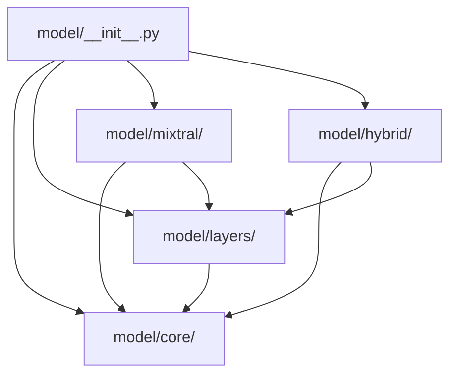
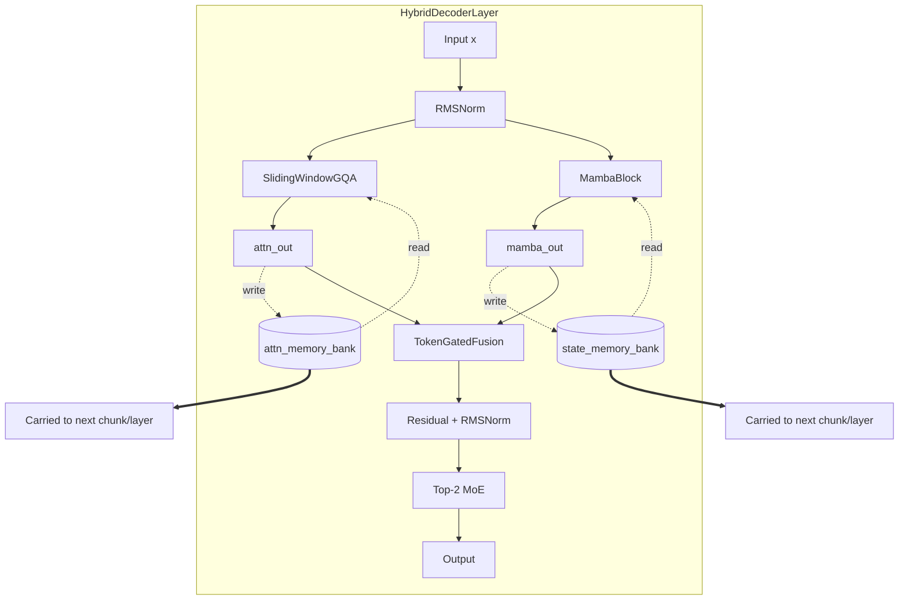

# Hybrid Mamba–MoE with Dual Memory

**Reference Implementation — Package Documentation**

| Field | Value |
|-------|-------|
| **Author** | Vishnu Vardhan |
| **Status** | Research prototype — design finalized (v2.1), implementation complete |
| **Primary entry point** | `from model import HybridForCausalLM, HybridMambaMoEConfig` |
| **Design document** | [`research/research.md`](../research/research.md) |
| **Loss specification** | [`research/loss-definitions.md`](../research/loss-definitions.md) |
| **Unit tests** | [`tests/test_model.py`](../tests/test_model.py) — 66 tests |
| **Revision marker** | `MEMORY_NAN_FIX_ID` (see §12) |

---

## Table of Contents

1. [Executive Summary](#1-executive-summary)
2. [Problem Statement](#2-problem-statement)
3. [Package Layout](#3-package-layout)
4. [Two Model Families](#4-two-model-families)
5. [Hybrid Decoder Layer — Architecture](#5-hybrid-decoder-layer--architecture)
6. [Component Reference](#6-component-reference)
7. [Compressive Memory System](#7-compressive-memory-system)
8. [Mamba Selective-SSM Branch](#8-mamba-selective-ssm-branch)
9. [Attention and MoE Subsystems](#9-attention-and-moe-subsystems)
10. [Training Objective](#10-training-objective)
11. [Chunked Long-Context Training](#11-chunked-long-context-training)
12. [Inference and `generate()`](#12-inference-and-generate)
13. [Configuration Reference](#13-configuration-reference)
14. [Falsification Hooks](#14-falsification-hooks)
15. [Numerical Stability and Correctness](#15-numerical-stability-and-correctness)
16. [Performance and Backends](#16-performance-and-backends)
17. [Testing Infrastructure](#17-testing-infrastructure)
18. [Usage Guide](#18-usage-guide)
19. [Comparison to Prior Architectures](#19-comparison-to-prior-architectures)
20. [Related Work](#20-related-work)
21. [Open Questions and Roadmap](#21-open-questions-and-roadmap)
22. [Appendix A — Per-Layer Data Flow](#appendix-a--per-layer-data-flow)
23. [Appendix B — File Map](#appendix-b--file-map)
24. [Appendix C — Glossary](#appendix-c--glossary)

---

## 1. Executive Summary

This package implements a **sub-quadratic language model architecture** that combines four ideas in a single decoder stack:

1. **Sliding-window grouped-query attention (GQA)** — precise local context at O(L·w) cost.
2. **Mamba selective state-space model (SSM)** — linear-time global context via a continuously updated hidden state.
3. **Dual compressive memory banks** — bounded-size (m slots), gated read/write explicit memory, one bank per branch.
4. **Top-2 sparse Mixture-of-Experts (MoE)** — conditional compute in the feed-forward path, Mixtral-style.

The central research hypothesis is that **explicit, addressable memory** can improve recall of rare, long-range facts that both sliding-window attention and SSM state tend to lose — without reintroducing O(L²) cost. The architecture achieves linear per-layer complexity throughout by:

- Bounding memory reads/writes to O(L·m) with fixed m ≪ L.
- Fusing attention-branch and SSM-branch outputs via **per-token gating** at O(L·d²), not sequence cross-attention at O(L²).
- Reusing Mixtral-class sparse MoE for the FFN.

Two complete model families share the GQA and MoE building blocks:

| Family | Config | Model | Role |
|--------|--------|-------|------|
| **Baseline** | `MixtralConfig` | `MixtralForCausalLM` | Ablation control: GQA + MoE only |
| **Hybrid** | `HybridMambaMoEConfig` | `HybridForCausalLM` | Full architecture with dual memory |

The implementation is feature-complete for training and autoregressive inference, including eight memory-specific auxiliary losses, chunked truncated-BPTT training, VRAM-efficient CE streaming, incremental KV/Mamba/memory caching, and 83 unit tests. **What remains scientifically unproven** is whether the memory component is *indispensable* — see §21 and the falsification plan in `research/research.md` §6.

---

## 2. Problem Statement

Transformer decoders face three structural limitations that worsen at long context:

| Limitation | Mechanism | Consequence |
|------------|-----------|-------------|
| **Quadratic compute** | Full self-attention is O(L²) | Long-context inference (100K+ tokens) is expensive or infeasible |
| **No persistent addressable memory** | Knowledge lives only in KV cache or SSM state | Rare facts stated early get diluted or fall outside the attention window |
| **Uniform per-token compute** | Every token uses the same dense FFN | No mechanism to allocate extra compute where needed |

Existing partial solutions:

- **Mamba / SSMs** — fix compute (O(L)) but exhibit recency bias; state is continuously overwritten.
- **Sliding-window attention** — cheap and precise locally, zero visibility beyond window w.
- **Mixtral MoE** — sparse routing, but does not address context length or explicit memory.
- **Jamba** — Mamba + attention + MoE, closest prior work, but **no explicit queryable memory**.

**Our question:** Can we retain linear-time, sparse-compute benefits while adding bounded-cost memory that measurably improves rare long-range recall — without quadratic fusion or attention?

---

## 3. Package Layout

The `model/` package is organized into four logical subpackages plus a root re-export layer. External code should import from `model` directly; subpackage paths are for maintainers and internal wiring.

```
model/
├── __init__.py          # Public API — re-exports all symbols
├── README.md            # This document
│
├── core/                # Configuration, constants, dtype helpers, builders
│   ├── config.py        # MixtralConfig, HybridMambaMoEConfig, MambaCache
│   ├── constants.py     # MEMORY_NAN_FIX_ID
│   ├── dtype.py         # FP32 promotion under AMP
│   └── builders.py      # count_trainable_params, build_test3_null_baseline_config
│
├── layers/              # Shared neural building blocks (both model families)
│   ├── norm.py          # RMSNorm
│   ├── rope.py          # RotaryEmbedding, apply_rotary_pos_emb
│   ├── attention.py     # SlidingWindowGQA
│   ├── moe.py           # MOERouter, SwiGLUExpert, DroplessMoELayer
│   └── fusion.py        # TokenGatedFusion (hybrid only, but logically a layer)
│
├── mixtral/             # Baseline ablation model
│   └── model.py         # MixtralDecoderLayer, MixtralModel, MixtralForCausalLM
│
└── hybrid/              # Research model + specialized subsystems
    ├── losses.py        # Eight auxiliary losses + schedules
    ├── memory.py        # CompressiveMemoryBank, MemoryWriteBuffer, batched ops
    ├── mamba.py         # MambaBlock, scan backends, diagnostics
    ├── layer.py         # HybridDecoderLayer
    └── model.py         # HybridModel, HybridForCausalLM, generate()
```

### Dependency graph



**Design principle:** Hybrid-only components (`memory`, `mamba`, auxiliary `losses`) live under `hybrid/` so `layers/` remains genuinely shared between Mixtral and Hybrid families.

---

## 4. Two Model Families

### 4.1 Mixtral Baseline (`MixtralForCausalLM`)

A control model for ablations. Each `MixtralDecoderLayer` applies:

```
x → RMSNorm → SlidingWindowGQA → residual
  → RMSNorm → Top-2 MoE → residual
```

Training loss:

```
loss = ce_loss + 0.02 · aux_loss + 0.005 · z_loss
```

Where `aux_loss` is Switch-Transformer load balancing and `z_loss` penalizes large router log-sum-exp values. No Mamba branch, no memory banks, no fusion gate.

**When to use:** Any experiment where you need an apples-to-apples comparison against the hybrid stack at matched GQA+MoE capacity — e.g., "does dual memory help beyond what a bigger SSM state would provide?" (Test 3).

### 4.2 Hybrid Model (`HybridForCausalLM`)

The full research architecture. Each `HybridDecoderLayer` runs parallel GQA and Mamba branches, conditions each branch on its memory bank, fuses branch outputs, and applies MoE. See §5 for the complete per-layer diagram.

**When to use:** All experiments targeting long-context recall, memory falsification tests, and production training runs described in `research/research.md`.

---

## 5. Hybrid Decoder Layer — Architecture

### 5.1 High-level diagram



### 5.2 Per-layer compute summary

| Component | Role | Asymptotic cost |
|-----------|------|-----------------|
| Sliding Window GQA | Local precise attention | O(L·w), w = window size |
| MambaBlock | Linear global context via SSM | O(L·d·n), n = state dim |
| CompressiveMemoryBank (×2) | Gated read/write over m slots | O(L·m), m fixed |
| TokenGatedFusion | Per-token branch combination | O(L·d²) |
| Top-2 MoE | Sparse FFN | O(L·2·d_ff·d) |

**Total per layer:** O(L) when m, w, n, d are held constant — the design target for 100K+ token contexts.

### 5.3 Memory conditioning semantics (critical detail)

Memory is **not** mixed after the branches. The implementation matches `research/research.md` §3.3:

1. **Read path:** Each bank is read with the current token representations as queries. The read output is concatenated with the shared RMSNorm'd hidden state and projected through `attn_memory_combine` / `state_memory_combine` **before** entering GQA and Mamba respectively.

2. **Write path:** **Raw** branch outputs (`attn_out`, `mamba_out`) — not the memory-augmented tensors — are accumulated and written back to the banks via a single-sigmoid gated EMA update.

This read-into-input / write-from-output contract is what makes the banks a genuine memory system rather than a static learned bias on the residual stream.

### 5.4 Layer forward signature

`HybridDecoderLayer.forward()` returns:

| Output | Type | Description |
|--------|------|-------------|
| `x_out` | `Tensor [B,L,d]` | Layer output hidden states |
| `aux_loss` | `Tensor` | MoE router load-balancing loss |
| `z_loss` | `Tensor` | MoE router z-loss |
| `present_key_value` | `tuple` or `None` | GQA KV cache if `use_cache=True` |
| `new_memory_state` | `HybridMemoryState` or `None` | Updated (attn_bank, state_bank) |
| `new_mamba_cache` | `MambaCache` or `None` | `(conv_state, ssm_state)` |
| `gate_stats` | `dict[str, Tensor]` | Detached write-gate means for logging |
| `new_write_buffer` | `MemoryWriteBuffer` or `None` | Pending decode writes |
| `layer_aux` | `HybridLayerAuxLosses` | Per-layer raw auxiliary loss scalars |

---

## 6. Component Reference

### 6.1 `model/core/`

| Module | Key symbols | Purpose |
|--------|-------------|---------|
| `config.py` | `MixtralConfig`, `HybridMambaMoEConfig`, `MambaCache` | All hyperparameters; JSON serialize/deserialize |
| `constants.py` | `MEMORY_NAN_FIX_ID` | Revision marker for memory-path NaN guards |
| `dtype.py` | `_promote_fp32`, `_restore_dtype` | Numerically sensitive ops under AMP |
| `builders.py` | `count_trainable_params`, `build_test3_null_baseline_config` | Param budgeting and Test 3 null baseline |

`HybridMambaMoEConfig` extends `MixtralConfig` — all GQA and MoE fields are reused. Hybrid-specific fields are documented in §13.

### 6.2 `model/layers/`

Shared building blocks used by both model families:

| Module | Class | Notes |
|--------|-------|-------|
| `norm.py` | `RMSNorm` | Pre-norm placement; eps from config |
| `rope.py` | `RotaryEmbedding` | Fixed-size cache up to `max_position_embeddings`; fails loudly if exceeded |
| `attention.py` | `SlidingWindowGQA` | SDPA-only; KV truncated to window; mask aligned with truncated KV |
| `moe.py` | `MOERouter`, `SwiGLUExpert`, `DroplessMoELayer` | Top-k routing, optional capacity factor, grouped dispatch |
| `fusion.py` | `TokenGatedFusion` | Sigmoid gate over `[attn_out; mamba_out]` per token |

### 6.3 `model/mixtral/`

| Class | Description |
|-------|-------------|
| `MixtralDecoderLayer` | Single transformer-MoE layer |
| `MixtralModel` | Embedding + N layers + final RMSNorm |
| `MixtralForCausalLM` | Adds `lm_head`; computes CE + router losses |
| `MixtralTrainingOutput` | Dataclass with logits, losses, KV cache |

### 6.4 `model/hybrid/`

| Module | Key symbols |
|--------|-------------|
| `losses.py` | `HybridLayerAuxLosses`, eight loss functions, warmup schedules |
| `memory.py` | `CompressiveMemoryBank`, `MemoryWriteBuffer`, batched read/write |
| `mamba.py` | `MambaBlock`, fused scan, fallback tiers, `log_mamba_backend()` |
| `layer.py` | `HybridDecoderLayer`, `_hybrid_layer_forward` |
| `model.py` | `HybridModel`, `HybridForCausalLM`, `generate()` |

---

## 7. Compressive Memory System

### 7.1 `CompressiveMemoryBank`

Each bank maintains **m fixed slots** of dimension d (config: `memory_size`, default 64). Core operations:

**Read:** Multi-head scaled dot-product attention where chunk tokens are queries and memory slots are keys/values. Cost O(L·m·d).

**Write:** A learned `summary_query` attends over the current chunk to produce a compressed summary. A single-sigmoid gate blends the summary into existing memory (an EMA-style convex blend, not a full GRU cell — no reset/forget pair):

```
gate = σ(W · [memory; summary])
new_memory = gate ⊙ memory + (1 − gate) ⊙ update(summary)
```

Padding-safe: all-masked rows skip writes; gate/summary sanitized to finite values when no valid tokens exist.

**Training-only aux modules** (omitted when `use_auxiliary_losses=False`):

- `MemoryReconstructionDecoder` — cross-attention decoder for L_recon
- `assoc_key`, `assoc_val` — linear projections for L_assoc

### 7.2 Dual-bank design

| Bank | Paired branch | Combine layer |
|------|---------------|---------------|
| `attn_memory_bank` | SlidingWindowGQA | `attn_memory_combine` |
| `state_memory_bank` | MambaBlock | `state_memory_combine` |

Banks are **independent** — separate parameters, separate states, separate write/read paths. `batched_dual_memory_read` and `batched_dual_memory_write` fuse both banks into single stacked attention passes for throughput.

### 7.3 `MemoryWriteBuffer`

During decode and chunked prefill, raw branch outputs accumulate in a pre-allocated buffer with a **per-token validity mask** (`mask_buf`). This ensures:

- Multi-step decode appends do not reconstruct prior padding as valid tokens.
- Write cadence matches training chunk semantics (`memory_write_interval` / `memory_chunk_size`).
- `append_single_token()` fast path for single-token decode steps.

When the buffer fills or a write interval elapses, `batched_dual_memory_write` flushes both banks atomically.

### 7.4 Memory state threading

`HybridMemoryState = tuple[Tensor, Tensor]` — one tensor per bank, shape `[B, m, d]`.

States are threaded:

- **Across layers** within one forward pass (each layer has its own banks).
- **Across sequence chunks** during chunked training (truncated BPTT).
- **Across decode steps** via `generate()` cache threading.

`HybridModel.zero_memory_states()` returns zero tensors of the correct shape — Test 1 falsification hook.

---

## 8. Mamba Selective-SSM Branch

### 8.1 `MambaBlock` overview

Implements the selective SSM (S6) from the Mamba literature:

1. Input projection → split into `x` and `z` gates.
2. Depthwise causal Conv1d over `x`.
3. Low-rank projection to Δ, B, C SSM parameters.
4. Selective scan: `h_t = exp(Δ·A) ⊙ h_{t-1} + Δ·B·u_t`, `y_t = C·h_t + D·u_t`.
5. Output gate: `y = scan_out ⊙ silu(z)`.
6. Output projection back to hidden size.

`dt_proj.bias` is initialized to Mamba-standard softplus-uniform range and marked `_no_reinit` so `_init_weights` does not zero it.

### 8.2 Four-tier scan dispatch

When `mamba-ssm` fused CUDA kernels are unavailable, the block selects a PyTorch fallback by sequence length:

| Tier | Condition | Method | Training memory |
|------|-----------|--------|-----------------|
| 1 | CUDA + `use_fused_mamba_scan` + no padding | `mamba-ssm` fused `selective_scan` | Lowest |
| 1b | CUDA + padded batch | Per-row unpadded fused scan | Low |
| 2 | `use_parallel_scan` or `L ≤ 4096` | Hillis-Steele parallel scan | O(L log L) |
| 3 | `4096 < L ≤ 65536` | Blocked vectorized scan | O(L) work, moderate memory |
| 4 | `L > 65536` | Sequential scan + optional checkpoint | O(L) work, lowest memory |

`mamba_internal_checkpoint` enables gradient checkpointing on tiers 3–4 when layer checkpointing is off — avoids double-checkpointing when `gradient_checkpointing=True`.

### 8.3 Incremental decode

`MambaBlock.step()` runs a single-token update using in-place conv buffer shift and SSM state recurrence. Returns updated `(conv_state, ssm_state)` for `generate()`.

`allocate_inference_cache()` pre-allocates zero states for batch prefill initialization.

### 8.4 Diagnostics

| Function | Purpose |
|----------|---------|
| `log_mamba_backend(config)` | Human-readable summary of active scan backend |
| `probe_mamba_scan_timing(config)` | One-step fused vs fallback timing on CUDA |
| `get_mamba_scan_stats()` | Counters: `fused_full_batch`, `fused_unpadded_batch`, `pytorch_fallback` |
| `reset_mamba_scan_stats()` | Reset counters at training run start |
| `fused_mamba_scan_available()` | Whether `mamba-ssm` is importable |

---

## 9. Attention and MoE Subsystems

### 9.1 `SlidingWindowGQA`

Mistral-style grouped-query attention with a sliding causal window:

- Queries: `num_heads` heads; keys/values: `num_kv_heads` heads with repeat-interleave expansion.
- RoPE applied via `RotaryEmbedding` with configurable `rope_theta` and `max_position_embeddings`.
- KV cache stores only the trailing `window_size` tokens (not full history).
- **Critical fix:** When KV is truncated, `attention_mask` is truncated to match — prevents shape mismatch during `generate()` once `seq_len > window_size`.

Uses `torch.nn.functional.scaled_dot_product_attention` exclusively. An experimental `flex_attention` path was removed (FSDP-unsafe global mask, incorrect indexing, unsupported on T4).

### 9.2 `MOERouter`

Top-k sparse routing (default k=2, E=8 experts):

- Full softmax over all experts for Switch-Transformer load balancing (`f_i`, `p_i` statistics).
- Top-k weights renormalized for dispatch.
- Router logits clamped to [-30, 30] before softmax for FP16 stability.
- Router matmul runs at native weight dtype; only logits are promoted to FP32 for stability.

### 9.3 `DroplessMoELayer`

Token dispatch to experts with three backends:

1. **Grouped GEMM** (`use_grouped_gemm=True`) — `torch._grouped_mm` when available.
2. **Grouped dispatch** (`use_grouped_moe_dispatch=True`) — sort tokens by expert, stacked weight tensors.
3. **Loop dispatch** — per-expert `nn.ModuleList` fallback.

Optional `capacity_factor` bounds tokens per expert (memory safety valve). Default `None` = fully dropless, batch-independent routing — preferred for research reproducibility.

---

## 10. Training Objective

### 10.1 Combined loss

```
L_total = ce_loss
        + 0.02  · aux_loss          # MoE load balancing
        + 0.005 · z_loss            # MoE router logit stability
        + Σᵢ λᵢ · Lᵢ               # eight auxiliary terms (hybrid only)
```

Auxiliary terms are **training-only** (`use_auxiliary_losses=True` by default). Inference and `generate()` do not compute them. Training-only modules (`recon_decoder`, `assoc_key`, `assoc_val`) are excluded from param counts via `count_trainable_params(..., exclude_training_aux=True)`.

### 10.2 Auxiliary loss catalog

| # | Symbol | Default λ | Warmup | Purpose |
|---|--------|-----------|--------|---------|
| 1 | `L_recon` | 0.08 | — | Reconstruct chunk from write summary |
| 2 | `L_assoc` | 1.2e-4 | 5% steps | Post-write key→value retrieval |
| 3 | `L_gate` | 1e-3 | — | Write-gate entropy (anti-saturation) |
| 4 | `L_read` | 5e-3 | — | Memory combine layer utilization floor |
| 5 | `L_fusion` | 8e-3 | — | Fusion gate balance toward 0.5 |
| 6 | `L_expert` | 2e-3 | 10% steps | Expert output orthogonality + routing variance |
| 7 | `L_ssm` | 1e-5 | — | SSM state norm hinge (γ from calibration) |
| 8 | `L_slot` | 3e-3 | — | Intra/cross-bank slot diversity |

Full formulas and tuning signals: `research/loss-definitions.md`.

### 10.3 The write-path gradient problem

Even with truncated BPTT across `memory_chunk_size` chunks, write parameters receive **sparse** CE gradients:

- Within a chunk, written memory is not re-read in the same chunk.
- The last chunk's write receives no future CE signal.

Auxiliary losses L_recon and L_assoc exist specifically to give the write path a **direct** training signal. `HybridForCausalLM` warns (or raises in `debug_state_checks` mode) if `use_dual_memory=True` with `use_auxiliary_losses=False`.

### 10.4 Schedule functions

```python
_aux_loss_schedule(step, max_steps, warmup_fraction)  # linear 0→1 for L_assoc
_expert_loss_schedule(step, max_steps, warmup_fraction)  # step-on at warmup_fraction
```

---

## 11. Chunked Long-Context Training

When `seq_len > memory_chunk_size` (default 512) and `use_dual_memory=True`, `HybridForCausalLM` routes to `_forward_chunked()`:

1. Split sequence into chunks of size `memory_chunk_size`.
2. Thread `memory_states` across chunks inside **one** backward pass (truncated BPTT).
3. Accumulate router aux/z losses and auxiliary losses token-weighted across chunks.
4. If `stream_chunked_ce_loss=True` (default): compute CE on valid label positions only — peak logits `[N_valid, V]` not `[B, L, V]`.
5. If `return_logits=False`: skip materializing full `[B, L, V]` logits tensor entirely.

**VRAM impact:** For vocab V=32K, hidden d=4096, batch B=2, chunk L=512:

- Full logits per chunk: ~134 MB (fp16) per chunk materialized.
- Streamed CE: proportional to valid tokens only — critical for cloud training at ~200M params.

`gradient_checkpointing=True` checkpoints each `HybridDecoderLayer` forward via `_hybrid_layer_forward`. Mamba internal scan checkpointing is automatically suppressed when layer checkpointing is active to avoid double checkpoint overhead.

---

## 12. Inference and `generate()`

### 12.1 Cache types

| Cache | Type | Per | Purpose |
|-------|------|-----|---------|
| `past_key_values` | `list[tuple[K,V]]` | Layer | GQA sliding window KV |
| `mamba_caches` | `list[MambaCache]` | Layer | `(conv_state, ssm_state)` |
| `memory_states` | `list[HybridMemoryState]` | Layer | Dual bank tensors |
| `write_buffers` | `list[MemoryWriteBuffer]` | Layer | Pending branch outputs |

### 12.2 `generate()` pipeline

1. **Chunked prefill** — processes prompt in `memory_write_interval` chunks; flushes memory writes at chunk boundaries.
2. **Single-token decode loop** — appends one token per step; accumulates branch outputs in `MemoryWriteBuffer`.
3. **Memory write cadence** — writes every `memory_write_interval` tokens (defaults to `memory_chunk_size`).
4. **Finished rows** — `active_batch_mask` freezes KV/Mamba/memory updates for sequences that hit `eos_token_id`.
5. **Final flush** — any partial write buffer is flushed via `_flush_memory_write_buffers()`.
6. **CUDA graph decode (removed)** — the former `use_cuda_graph=True` fast path was removed: its capture/replay silently corrupted recurrent state (warm-up ran against live caches; replay froze KV/SSM/memory at capture-time addresses). The flag remains in the config as a documented no-op that warns and decodes eagerly.

### 12.3 Sampling

Supports `temperature`, `top_k`, `top_p`, `do_sample`, and `eos_token_id` (defaults to `config.eos_token_id`). Greedy decoding uses `argmax`; sampling uses filtered softmax + multinomial.

---

## 13. Configuration Reference

### 13.1 Shared fields (`MixtralConfig`)

| Field | Default | Description |
|-------|---------|-------------|
| `vocab_size` | 32000 | Embedding / lm_head rows |
| `hidden_size` | 4096 | Model dimension d |
| `num_layers` | 32 | Decoder depth |
| `num_heads` | 32 | GQA query heads |
| `num_kv_heads` | 8 | GQA key/value heads |
| `head_dim` | 128 | Per-head dimension |
| `intermediate_size` | 14336 | MoE expert inner dim |
| `window_size` | 4096 | Sliding attention window w |
| `num_experts` | 8 | MoE expert count E |
| `top_k` | 2 | Experts per token |
| `capacity_factor` | `None` | MoE capacity limit; None = dropless |
| `max_position_embeddings` | 32768 | RoPE cache upper bound |
| `rope_theta` | 10000.0 | RoPE base frequency |
| `router_aux_loss_coef` | 0.02 | Load balancing weight |
| `router_z_loss_coef` | 0.005 | Router z-loss weight |
| `label_ignore_index` | -100 | CE ignore index for padding |
| `tie_word_embeddings` | False | Share embed and lm_head weights |

### 13.2 Hybrid-specific fields (`HybridMambaMoEConfig`)

| Field | Default | Description |
|-------|---------|-------------|
| `mamba_state_size` | 16 | SSM state dimension n |
| `mamba_conv_kernel` | 4 | Depthwise conv kernel size |
| `mamba_expand` | 2 | Mamba inner dim multiplier |
| `use_dual_memory` | True | Enable memory banks; False = Jamba-like |
| `memory_size` | 64 | Slots per bank m |
| `memory_num_heads` | 8 | Memory attention heads |
| `memory_chunk_size` | 512 | Training BPTT chunk; None disables |
| `memory_write_interval` | None | Decode write cadence; None → chunk size |
| `use_fused_mamba_scan` | True | Prefer mamba-ssm CUDA kernels |
| `use_parallel_scan` | False | Force Hillis-Steele scan |
| `parallel_scan_fallback_max_len` | 4096 | Tier 2 upper bound |
| `blocked_scan_min_len` | 4096 | Tier 3 lower bound |
| `sequential_scan_min_len` | 65536 | Tier 4 lower bound |
| `gradient_checkpointing` | False | Per-layer activation checkpointing |
| `mamba_internal_checkpoint` | True | Scan-level checkpoint when layer ckpt off |
| `stream_chunked_ce_loss` | True | VRAM-efficient chunked CE |
| `return_logits` | True | Return full logits tensor |
| `use_grouped_moe_dispatch` | True | Sort-by-expert MoE dispatch |
| `use_cuda_graph` | False | No-op (CUDA-graph decode removed; warns if enabled) |
| `use_torch_compile` | False | `torch.compile` per layer |
| `use_auxiliary_losses` | True | Eight training aux losses |
| `debug_state_checks` | False | Assert cache/mask invariants |

All `lambda_*` auxiliary coefficients are on `HybridMambaMoEConfig` — see `model/core/config.py` for complete list.

---

## 14. Falsification Hooks

Built-in ablation and test infrastructure (`research/research.md` §6):

| Hook | API | Test |
|------|-----|------|
| Memory off (architectural) | `config.use_dual_memory = False` | Jamba-like baseline |
| Memory zeroed at inference | `model.model.zero_memory_states(B, device, dtype)` | Test 1: rare-fact recall |
| Param-matched SSM-only null | `build_test3_null_baseline_config(hybrid_cfg)` | Test 3: bigger state, no banks |
| Write without read | `skip_memory_write=True` in forward/generate | Write-path ablation |
| Gate monitoring | `output.gate_stats` in `HybridTrainingOutput` | Test 2: saturation check |

`build_test3_null_baseline_config()` binary-searches `mamba_state_size` then `mamba_expand` to match parameter count within 2% tolerance.

---

## 15. Numerical Stability and Correctness

### 15.1 `MEMORY_NAN_FIX_ID`

Current value: `all_masked_softmax+write_buffer_mask+masked_recon_gate-v2`

Logged by `scripts/test_cloud_train.py` at startup so cloud runs can confirm the correct code revision. Bump this constant whenever memory-path NaN guards change.

### 15.2 Known fixes (implementation history)

| Issue | Fix |
|-------|-----|
| GQA mask/KV length mismatch past `window_size` | Truncate mask with KV |
| All-padding rows → NaN softmax in memory attend | Zero-score fallback for all-masked rows |
| RotaryEmbedding growing buffers under FSDP | Fixed-size cache; loud failure if exceeded |
| Write-buffer padding reconstructed as valid | Per-token `mask_buf` with append |
| Fused unpadded scan in-place buffer breaks autograd | Cat/pad/stack restore path preserves gradients |
| Router FP16 matmul dtype mismatch without outer autocast | Logits promoted to FP32 after matmul at native dtype |

### 15.3 Padding contract

- Training and prefill expect **right-padded** `attention_mask` (valid tokens form a left prefix).
- `_assert_right_padded_attention_mask()` validates this when `debug_state_checks=True`.
- Mamba scan applies identity transition on pad positions so SSM state does not decay through padding.

---

## 16. Performance and Backends

### 16.1 Parameter overhead vs Jamba-like baseline

Extra parameters per hybrid layer (dual memory + combine layers): approximately **6d²**, comparable to the O(L²) cross-attention fusion module that was removed during design review. Net parameter increase is small relative to MoE FFN parameters.

### 16.2 Production recommendations

| Concern | Recommendation |
|---------|----------------|
| Mamba scan speed | Install `mamba-ssm` on CUDA training hosts |
| Long-context training VRAM | `return_logits=False`, `stream_chunked_ce_loss=True` |
| Decode latency | eager incremental decode (`MambaBlock.step()`); no CUDA-graph path |
| MoE memory spikes | `capacity_factor=1.25` only on memory-constrained hardware |
| Layer compile | `use_torch_compile=True` (disables gradient checkpointing) |

### 16.3 Batched memory ops

`batched_dual_memory_read` and `batched_dual_memory_write` stack projections across both banks into one batched attention pass — reduces kernel launch overhead vs two independent bank calls.

---

## 17. Testing Infrastructure

| Suite | Location | Coverage |
|-------|----------|----------|
| Unit tests | `tests/test_model.py` | 66 tests — forward/backward, chunked training, incremental vs full-forward parity, memory persistence, padding/NaN edges, fused Mamba parity, aux loss gradients, MoE dispatch, CUDA-graph decode, falsification hooks |
| Toy train smoke | `tests/test_toy_train_smoke.py` | 10-step training loop, param budget |
| Cloud smoke | `scripts/test_cloud_train.py` | ~200M param IMDB one-epoch run |

**Caching correctness test:** incremental `generate()` vs full-forward last-logit cosine similarity — re-run before latency-sensitive deployment at larger scales.

---

## 18. Usage Guide

### 18.1 Minimal forward pass

```python
import torch
from model import HybridForCausalLM, HybridMambaMoEConfig

cfg = HybridMambaMoEConfig(
    vocab_size=3200,
    hidden_size=256,
    num_layers=2,
    num_heads=4,
    num_kv_heads=2,
    head_dim=64,
    intermediate_size=512,
    window_size=16,
    num_experts=4,
    memory_size=16,
    use_dual_memory=True,
)

model = HybridForCausalLM(cfg).train()
ids = torch.randint(0, cfg.vocab_size, (2, 128))
labels = ids.roll(shifts=-1, dims=1)

out = model(input_ids=ids, labels=labels, training_step=0, max_training_steps=1000)
out.loss.backward()
```

### 18.2 Baseline comparison

```python
from model import MixtralForCausalLM, MixtralConfig

cfg = MixtralConfig(hidden_size=256, num_layers=2, num_experts=4)
baseline = MixtralForCausalLM(cfg)
```

### 18.3 Param-matched null baseline (Test 3)

```python
from model import build_test3_null_baseline_config, HybridMambaMoEConfig

hybrid_cfg = HybridMambaMoEConfig(hidden_size=512, num_layers=8)
null_cfg = build_test3_null_baseline_config(hybrid_cfg, tolerance=0.02)
# null_cfg.use_dual_memory == False, mamba_state_size expanded to match param count
```

### 18.4 Mamba backend diagnostics

```python
from model import log_mamba_backend, probe_mamba_scan_timing, HybridMambaMoEConfig

cfg = HybridMambaMoEConfig()
print(log_mamba_backend(cfg))
print(probe_mamba_scan_timing(cfg))
```

### 18.5 Generation

```python
model = HybridForCausalLM(cfg).eval()
prompt = torch.randint(0, cfg.vocab_size, (1, 32))
generated = model.generate(prompt, max_new_tokens=50, do_sample=False)
```

---

## 19. Comparison to Prior Architectures

| Feature | Transformer | Mamba | Jamba | Mixtral (baseline) | Hybrid (this) |
|---------|-------------|-------|-------|-------------------|---------------|
| Local attention | Full O(L²) | None | GQA | Sliding GQA | Sliding GQA |
| SSM branch | No | Yes | Yes | No | Yes |
| Explicit memory | No | No | No | No | Dual gated banks |
| Sparse MoE | No | No | Yes | Yes | Yes |
| Time complexity | O(L²) | O(L) | O(L) | O(L) | O(L) |
| Long-range rare-fact recall | Window-limited | Recency bias | Recency bias | Window-limited | **Targeted — unproven** |

---

## 20. Related Work

- **Mamba** (Gu & Dao, 2023) — selective state spaces for linear-time modeling.
- **Jamba** (Lieber et al., 2024) — hybrid Mamba-Transformer-MoE; closest architectural prior without explicit memory.
- **Mixtral** (Jiang et al., 2024) — Top-2 sparse MoE; router losses reused here.
- **Compressive Transformer** (Rae et al., ICLR 2020) — gated compressive memory; basis for `CompressiveMemoryBank` and L_recon.
- **Titans** (Behrouz et al., NeurIPS 2025) — associative memory loss; basis for L_assoc surprise weighting.
- **Perceiver / Perceiver IO** — linear attention via small latent set; same trick as O(L·m) memory read.

---

## 21. Open Questions and Roadmap

### 21.1 Central open question

**Is explicit dual memory indispensable?** Mamba's hidden state is already a compressed summary of all prior tokens. The falsification tests in `research/research.md` §6 must pass before scaling:

1. Rare-fact recall degrades when memory is zeroed at inference.
2. Write gates show non-degenerate activity during training.
3. Hybrid beats a parameter-matched larger-SSM null baseline on recall tasks.

### 21.2 Engineering roadmap

1. Run falsification tests at small scale (hooks are ready).
2. Cloud smoke → short training runs via `scripts/test_cloud_train.py`.
3. Build needle/rare-fact eval harness with fixed seeds.
4. If memory is redundant: simplify to `use_dual_memory=False` and redirect effort.
5. Benchmark wall-clock and memory vs Mixtral baseline at matched param count on progressively longer contexts.

### 21.3 Tuning gaps

Eight λ coefficients with warmup schedules — defaults are starting points from `loss-definitions.md`. No large-scale hyperparameter sweep has been completed.

---

## Appendix A — Per-Layer Data Flow

Step-by-step through `HybridDecoderLayer.forward()`:

```
1.  residual = x
2.  x_norm = RMSNorm(x)
3.  Apply padding mask to x_norm if attention_mask present

4.  IF use_dual_memory:
      a. Read attn_bank and state_bank via batched_dual_memory_read(x_norm)
      b. attn_input = attn_memory_combine([x_norm; attn_read])
      c. mamba_input = state_memory_combine([x_norm; state_read])
    ELSE:
      attn_input = mamba_input = x_norm

5.  attn_out, kv_cache = SlidingWindowGQA(attn_input, ...)
6.  mamba_out, mamba_cache, ssm_state = MambaBlock(mamba_input, ...)

7.  IF use_dual_memory:
      a. Append attn_out, mamba_out to MemoryWriteBuffer (with validity mask)
      b. IF not skip_memory_write and buffer full/interval reached:
           batched_dual_memory_write → update both banks
           compute L_recon, L_assoc, L_gate, L_slot (if training + aux on)
      c. ELSE: carry buffer forward

8.  fused, fusion_gate = TokenGatedFusion(attn_out, mamba_out)
9.  x = residual + fused

10. moe_out, aux, z, expert_loss = MoE(RMSNorm(x))
11. x_out = x + moe_out

12. IF training + aux on:
      L_read from combine layer weight norms
      L_fusion from fusion_gate mean
      L_ssm from ssm_state vs calibrated gamma
      L_expert from MoE (if expert schedule active)

13. Return x_out, aux, z, caches, gate_stats, buffer, layer_aux
```

---

## Appendix B — File Map

| Path | Primary exports |
|------|-----------------|
| `model/__init__.py` | Full public API |
| `model/core/config.py` | `MixtralConfig`, `HybridMambaMoEConfig` |
| `model/core/builders.py` | `count_trainable_params`, `build_test3_null_baseline_config` |
| `model/core/constants.py` | `MEMORY_NAN_FIX_ID` |
| `model/layers/attention.py` | `SlidingWindowGQA` |
| `model/layers/moe.py` | `MOERouter`, `DroplessMoELayer`, `SwiGLUExpert` |
| `model/layers/fusion.py` | `TokenGatedFusion` |
| `model/mixtral/model.py` | `MixtralForCausalLM` |
| `model/hybrid/memory.py` | `CompressiveMemoryBank`, `MemoryWriteBuffer` |
| `model/hybrid/mamba.py` | `MambaBlock` |
| `model/hybrid/losses.py` | Auxiliary loss functions |
| `model/hybrid/layer.py` | `HybridDecoderLayer` |
| `model/hybrid/model.py` | `HybridForCausalLM`, `generate()` |

---

## Appendix C — Glossary

| Term | Definition |
|------|------------|
| **BPTT** | Backpropagation Through Time; here, truncated across `memory_chunk_size` chunks |
| **GQA** | Grouped-Query Attention; fewer KV heads than Q heads |
| **SSM** | State Space Model; recurrent hidden state updated per token |
| **MoE** | Mixture of Experts; sparse routing to subset of FFN experts |
| **m** | Memory bank slot count (`memory_size`, default 64) |
| **w** | Attention sliding window size (`window_size`, default 4096) |
| **n** | Mamba SSM state dimension (`mamba_state_size`, default 16) |
| **d** | Hidden dimension (`hidden_size`) |
| **L** | Sequence length |
| **Dropless MoE** | No token dropped from expert dispatch (`capacity_factor=None`) |
| **Write buffer** | Decode-time accumulator for chunk-aligned memory writes |
| **Falsification test** | Experiment designed to disprove a hypothesis (§14) |

---

*For the full research proposal, evaluation plan, and scientific motivation, see [`research/research.md`](../research/research.md). For loss formulas and hyperparameter tuning guidance, see [`research/loss-definitions.md`](../research/loss-definitions.md).*
