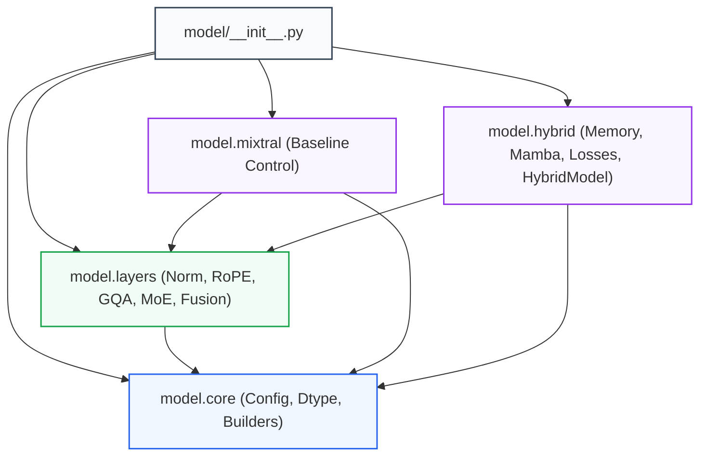

# Hybrid Mamba–MoE with Dual Compressive Memory: Architecture Specification & Developer Reference

[](https://pytorch.org/)
[](__init__.py)
[](../research/research.md)
[](core/constants.py)

> **Author / Lead Architect:** Vishnu Vardhan  
> **Status:** Research Reference Implementation (v2.1 Finalized & Verified)  
> **Primary Public Exports:** `from model import HybridForCausalLM, HybridMambaMoEConfig, MixtralForCausalLM, MixtralConfig`  
> **Design Specifications:** [`research/research.md`](../research/research.md) | [`research/loss-definitions.md`](../research/loss-definitions.md)  
> **Unit Test Coverage:** [`tests/test_model.py`](../tests/test_model.py) (83 tests covering forward, backward, AMP, caching, and scan backends)

---

## Table of Contents

1. [Architectural Philosophy & Design Principles](#1-architectural-philosophy--design-principles)
2. [Package Hierarchy & Modular Taxonomy](#2-package-hierarchy--modular-taxonomy)
3. [Two Model Families: Dual-Track Ablation Architecture](#3-two-model-families-dual-track-ablation-architecture)
4. [Mathematical Specification of `HybridDecoderLayer`](#4-mathematical-specification-of-hybriddecoderlayer)
5. [Subsystem Deep-Dive: Compressive Memory (`model.hybrid.memory`)](#5-subsystem-deep-dive-compressive-memory-modelhybridmemory)
6. [Subsystem Deep-Dive: Selective State-Space Branch (`model.hybrid.mamba`)](#6-subsystem-deep-dive-selective-state-space-branch-modelhybridmamba)
7. [Subsystem Deep-Dive: Attention & MoE Primitives (`model.layers`)](#7-subsystem-deep-dive-attention--moe-primitives-modellayers)
8. [Subsystem Deep-Dive: Multi-Task Objectives (`model.hybrid.losses`)](#8-subsystem-deep-dive-multi-task-objectives-modelhybridlosses)
9. [Subsystem Deep-Dive: Full Model Stacking & Long-Context Execution (`model.hybrid.model`)](#9-subsystem-deep-dive-full-model-stacking--long-context-execution-modelhybridmodel)
10. [Subsystem Deep-Dive: Core Utilities & Configuration (`model.core`)](#10-subsystem-deep-dive-core-utilities--configuration-modelcore)
11. [Numerical Stability, Padding Contracts & Defensive Engineering](#11-numerical-stability-padding-contracts--defensive-engineering)
12. [Falsification & Ablation API Reference](#12-falsification--ablation-api-reference)
13. [Developer Guide & Code Recipes](#13-developer-guide--code-recipes)
14. [Comprehensive Symbol Index](#14-comprehensive-symbol-index)

---

## 1. Architectural Philosophy & Design Principles

The `model/` package provides a reference PyTorch implementation of a sub-quadratic, long-context language model architecture. The design is governed by five foundational architectural principles:

```
┌─────────────────────────────────────────────────────────────────────────────┐
│                       CORE ARCHITECTURAL PRINCIPLES                         │
├──────────────────────────────┬──────────────────────────────┬───────────────┤
│ 1. Sub-Quadratic Complexity  │ 2. Genuine Read/Write Memory │ 3. Linear     │
│    Every layer scales as     │    Reads condition inputs;   │    Fusion     │
│    O(L) with sequence length │    writes accumulate outputs │    O(L·d²)    │
├──────────────────────────────┴──────────────────────────────┴───────────────┤
│ 4. Defensive Numerical Engineering: AMP FP32 promotions & logit clamping    │
│ 5. Multi-Tier Backend Acceleration: Fused CUDA -> Parallel -> Blocked Scan  │
└─────────────────────────────────────────────────────────────────────────────┘
```

1. **Strictly Sub-Quadratic Per-Layer Design:** Every neural component—sliding-window GQA, selective SSM, compressive memory cross-attention, token-wise fusion, and MoE routing—exhibits $\mathcal{O}(L)$ time complexity when sequence length $L$ scales and architectural hyper-parameters ($w, m, n, d$) remain constant.
2. **Genuine Read/Write Memory Semantics:** Memory banks are **not** static learned biases added to residual streams. Memory is explicitly read *prior* to branch execution to condition branch inputs, while *raw* branch outputs are written back into memory banks via gated Exponential Moving Average (EMA) updates.
3. **Linear Token-Gated Fusion:** Attention and SSM branch outputs are merged via an elementwise sigmoid gating network ($\mathcal{O}(L \cdot d^2)$), completely avoiding the quadratic $\mathcal{O}(L^2)$ sequence cross-attention bottleneck present in early hybrid concepts.
4. **Defensive Numerical Engineering:** Autocast mixed precision safely promotes numerically sensitive operations (selective scan recurrences, write-gate entropy calculations, memory slot cosine similarities, router logit normalization) to FP32 while executing high-throughput tensor contractions in native low precision.
5. **Pluggable Backend Acceleration:** The selective state-space branch implements a 4-tier execution hierarchy that automatically leverages fused CUDA kernels (`mamba-ssm`) when present, while gracefully falling back to numerically equivalent pure-PyTorch parallel, blocked, or sequential scans on standard CPU/GPU environments.

---

## 2. Package Hierarchy & Modular Taxonomy

The `model/` package is structured into four functional subpackages plus a top-level re-export layer:

```
model/
├── __init__.py                  # Top-level public API exports
├── README.md                    # This architecture specification
│
├── core/                        # Dataclasses, precision helpers, parameter builders
│   ├── config.py                # MixtralConfig, HybridMambaMoEConfig, MambaCache
│   ├── constants.py             # MEMORY_NAN_FIX_ID revision tags
│   ├── dtype.py                 # _promote_fp32, _restore_dtype, precision guards
│   ├── optim.py                 # split_muon_adam_params, _is_adamw_no_decay
│   └── builders.py              # count_trainable_params, build_test3_null_baseline_config
│
├── layers/                      # Shared neural building blocks (used across model families)
│   ├── norm.py                  # RMSNorm
│   ├── rope.py                  # RotaryEmbedding (fixed-capacity cache, FSDP-safe)
│   ├── attention.py             # SlidingWindowGQA (SDPA, sink tokens, QK-norm)
│   ├── moe.py                   # MOERouter, SwiGLUExpert, DroplessMoELayer
│   ├── fusion.py                # TokenGatedFusion
│   └── sampling.py              # top_k_filter, top_p_filter
│
├── mixtral/                     # Baseline control model (ablation reference)
│   └── model.py                 # MixtralDecoderLayer, MixtralModel, MixtralForCausalLM
│
└── hybrid/                      # Hybrid Mamba–MoE research architecture & memory subsystem
    ├── layer.py                 # HybridDecoderLayer, _hybrid_layer_forward
    ├── memory.py                # CompressiveMemoryBank, MemoryWriteBuffer, batched ops
    ├── mamba.py                 # MambaBlock, scan dispatch tiers, telemetry
    ├── losses.py                # 8 auxiliary loss functions, warmup schedules
    └── model.py                 # HybridModel, HybridForCausalLM, chunked BPTT, generate()
```

### Dependency Architecture



---

## 3. Two Model Families: Dual-Track Ablation Architecture

To ensure scientific rigor and reproducible ablation analysis, the package provides two parallel, parameter-matched model families:

```
                            MODEL FAMILY DUAL TRACK
                                       │
        ┌──────────────────────────────┴──────────────────────────────┐
        │                                                             │
        ▼                                                             ▼
[Mixtral Baseline Family]                                  [Hybrid Research Family]
• Class: MixtralForCausalLM                                • Class: HybridForCausalLM
• Config: MixtralConfig                                    • Config: HybridMambaMoEConfig
• Backbone: Sliding-Window GQA + MoE                       • Backbone: GQA + Mamba + Dual Memory + MoE
• Loss: CE + Router Aux + Router Z                         • Loss: CE + Router Aux + Router Z + 8 Aux Losses
• Purpose: Control for attention & MoE                     • Purpose: Long-context memory & SSM research
```

### 1. Baseline Control Family (`MixtralForCausalLM`)
* **Layer Composition:** `RMSNorm` $\to$ `SlidingWindowGQA` $\to$ `Residual` $\to$ `RMSNorm` $\to$ `DroplessMoELayer` $\to$ `Residual`.
* **Standard Loss Formulation:**
  $$\mathcal{L}_{\text{baseline}} = \mathcal{L}_{\text{CE}} + 0.02 \cdot \mathcal{L}_{\text{router\_aux}} + 0.005 \cdot \mathcal{L}_{\text{router\_z}}$$
* **Role:** Serves as the primary control for measuring the isolated impact of adding the selective SSM branch and dual compressive memory banks.

### 2. Full Hybrid Family (`HybridForCausalLM`)
* **Layer Composition:** `RMSNorm` $\to$ `Dual Memory Read` $\to$ Parallel (`SlidingWindowGQA` $\parallel$ `MambaBlock`) $\to$ `Dual Memory Write` $\to$ `TokenGatedFusion` $\to$ `Residual` $\to$ `RMSNorm` $\to$ `DroplessMoELayer` $\to$ `Residual`.
* **Full Multi-Task Loss Formulation:** Integrates language modeling cross-entropy, router load balancing, router z-loss, final logit z-loss, and the 8-objective memory auxiliary loss suite.

---

## 4. Mathematical Specification of `HybridDecoderLayer`

The `HybridDecoderLayer` processes hidden state $x \in \mathbb{R}^{B \times L \times d}$ through the following sequential tensor operations:

```
Step 1: Input Pre-Normalization
  x_norm = RMSNorm(x) * M_pad

Step 2: Dual Memory Cross-Attention Read
  A_read = BatchedCrossAttn(query=x_norm, key=M_attn, val=M_attn) ∈ ℝ^(B × L × d)
  S_read = BatchedCrossAttn(query=x_norm, key=M_state, val=M_state) ∈ ℝ^(B × L × d)
  attn_in = W_c^a · [x_norm ; A_read]
  mamba_in = W_c^s · [x_norm ; S_read]

Step 3: Parallel Branch Evaluation
  a_t, KV_cache = SlidingWindowGQA(attn_in, window=w, RoPE=fixed_cache)
  s_t, Mamba_cache, h_ssm = MambaBlock(mamba_in, conv_kernel=k, state_dim=n)

Step 4: Raw Output Accumulation & Gated Memory Write
  Buffer.append(a_t, s_t, mask=M_pad)
  S_a, S_s = CrossAttnSummarize(Q_summary, [a_t ; s_t])
  g_w = σ(W_g · [M_old ; S] + b_g)
  M_new = g_w ⊙ M_old + (1 - g_w) ⊙ W_u(S)

Step 5: Linear Token-Gated Branch Fusion
  g_t = σ(W_fusion · [a_t ; s_t] + b_fusion) ∈ ℝ^(B × L × d)
  fused = g_t ⊙ a_t + (1 - g_t) ⊙ s_t
  x_mid = x + fused * M_pad

Step 6: Sparse Mixture-of-Experts Feed-Forward
  moe_in = RMSNorm(x_mid) * M_pad
  topk_weights, topk_indices = Router(moe_in, k=2, E=8)
  moe_out = DroplessMoEDispatch(moe_in, topk_weights, topk_indices)
  x_out = x_mid + moe_out
```

### Complete Layer Forward Signature

```python
def forward(
    self,
    x: Tensor,                                          # [B, L, d]
    memory_state: tuple[Tensor, Tensor] | None = None,  # (M_attn, M_state): each [B, m, d]
    attention_mask: Tensor | None = None,               # [B, L] or [B, 1, 1, L]
    position_ids: Tensor | None = None,                 # [B, L]
    past_key_value: tuple[Tensor, Tensor] | None = None,# (K, V): each [B, H_kv, w, d_k]
    mamba_cache: tuple[Tensor, Tensor] | None = None,   # (conv_state, ssm_state)
    use_cache: bool = False,
    skip_memory_write: bool = False,
    write_buffer: MemoryWriteBuffer | None = None,
    active_batch_mask: Tensor | None = None,            # [B] bool
    training_step: int | None = None,
    max_training_steps: int | None = None,
    batch_has_padding: bool | None = None,
    layer_checkpointing_active: bool = False,
    decode_accumulate_only: bool = False,
) -> tuple[
    Tensor,                                             # x_out: [B, L, d]
    Tensor,                                             # router_aux_loss: scalar
    Tensor,                                             # router_z_loss: scalar
    tuple[Tensor, Tensor] | None,                       # present_key_value
    tuple[Tensor, Tensor] | None,                       # new_memory_state
    tuple[Tensor, Tensor] | None,                       # new_mamba_cache
    dict[str, Tensor],                                  # gate_stats
    MemoryWriteBuffer | None,                           # new_write_buffer
    HybridLayerAuxLosses,                               # raw per-layer auxiliary losses
]
```

---

## 5. Subsystem Deep-Dive: Compressive Memory (`model.hybrid.memory`)

### 1. Memory Bank Architecture (`CompressiveMemoryBank`)
Each bank maintains $m$ fixed-size memory slots ($m=64$ default) of dimension $d$.

* **Initialization:** Initial slot parameters $M_0 \in \mathbb{R}^{m \times d} \sim \mathcal{N}(0, 0.02^2)$ expanded to batch dimension $[B, m, d]$.
* **Read Mechanism:** Evaluates multi-head scaled dot-product attention where queries are generated from normalized inputs $x \in \mathbb{R}^{B \times L \times d}$ and keys/values are memory slots $M \in \mathbb{R}^{B \times m \times d}$. Complexity is $\mathcal{O}(B \cdot L \cdot m \cdot d)$.
* **Write Mechanism:** Learned summary queries $Q_{\text{summary}} \in \mathbb{R}^{m \times d}$ cross-attend over raw branch outputs to construct compressed chunk summary $S \in \mathbb{R}^{B \times m \times d}$. The memory update follows a convex EMA blend parameterized by a single-sigmoid gate:
  $$g = \sigma\left(W_g [M; S] + b_g\right), \quad M_{\text{updated}} = g \odot M + (1 - g) \odot W_u(S)$$
* **Padding Guard:** When all tokens in a row are padding, softmax scores are forced to $0.0$ and the memory state undergoes an identity transition ($M_{t} = M_{t-1}$).

### 2. Write Accumulator (`MemoryWriteBuffer`)
Pre-allocated, fixed-capacity ring buffer designed to eliminate dynamic memory allocation overhead during chunked training and single-token decode:

* **Validity Bitmask (`mask_buf`):** Stores a per-token boolean validity mask alongside accumulated branch outputs, preventing padded positions from being reconstructed as valid tokens across multi-step decode appends.
* **Fast-Path Decode Append:** `append_single_token()` updates rolling buffers via in-place slice copies without tensor concatenation.

### 3. Fused Dual-Bank Tensor Operations
* **`batched_dual_memory_read`:** Stacks projection weights across both `attn_memory_bank` and `state_memory_bank`, executing both memory reads in a single batched `torch.bmm` + attention pass.
* **`batched_dual_memory_write`:** Stacks summary query projections, write gates, and update projections across both banks, executing atomic dual-bank updates.

---

## 6. Subsystem Deep-Dive: Selective State-Space Branch (`model.hybrid.mamba`)

### 1. Mathematical Formulation (Mamba S6)
The selective state-space model maps input sequence $u \in \mathbb{R}^{B \times L \times d_{\text{inner}}}$ to output $y \in \mathbb{R}^{B \times L \times d_{\text{inner}}}$ via continuous-time latent state $h(t) \in \mathbb{R}^{n}$:

$$\Delta = \text{Softplus}\left(\text{Linear}_{\Delta}(\text{Conv1D}(u)) + b_{\Delta}\right)$$
$$A = -\exp(A_{\text{log}}), \quad \bar{A} = \exp(\Delta A), \quad \bar{B} = \Delta \cdot \text{Linear}_B(\text{Conv1D}(u))$$
$$h_t = \bar{A}_t h_{t-1} + \bar{B}_t u_t, \quad y_t = \text{Linear}_C(\text{Conv1D}(u)) h_t + D u_t$$
$$\text{output} = \text{Linear}_{\text{out}}(y \odot \text{SiLU}(z))$$

* **Initialization Safeguards:** `dt_proj.bias` is initialized to the official Mamba softplus-uniform distribution and tagged with `_no_reinit = True` to prevent model-wide reinitialization routines from zeroing it out. $A_{\text{log}}$ and $D$ are tagged with `_no_weight_decay = True`.

### 2. Multi-Tier Scan Dispatch Architecture

```
                                MAMBA SCAN DISPATCH
                                         │
                 ┌───────────────────────┴───────────────────────┐
                 │                                               │
                 ▼ (CUDA Available & No Padding)                 ▼ (PyTorch Fallback)
         [Tier 1: Fused CUDA]                           Sequence Length L?
         mamba_ssm.selective_scan                                │
                 │                               ┌───────────────┼───────────────┐
                 ▼ (CUDA + Padded Batch)         ▼ (L <= 4096)   ▼ (4096<L<=64K) ▼ (L > 64K)
         [Tier 1b: Unpadded Fused]          [Tier 2: Parallel] [Tier 3: Blocked] [Tier 4: Sequential]
         Per-row unpadded fused scan         Hillis-Steele     Vectorized Chunks  Checkpointed Recurrent
```

* **Tier 1 (Fused CUDA):** Direct C++/CUDA kernel via `mamba_ssm.ops.selective_scan_interface.selective_scan_fn`.
* **Tier 1b (Unpadded Fused Scan):** Dispatches unpadded valid prefixes per batch row through the fused kernel, reconstructing output tensors via `torch.stack` to preserve autograd gradient graphs.
* **Tier 2 (Parallel Associative Scan):** Hillis–Steele scan evaluating all prefix products in $\mathcal{O}(L \log L)$ work for sequences $L \le 4096$.
* **Tier 3 (Blocked Scan):** Divides sequence into 256-token blocks, evaluates parallel scans within blocks, and propagates state sequentially across block boundaries.
* **Tier 4 (Sequential Checkpointed Scan):** Evaluates an $\mathcal{O}(L)$ work sequential loop wrapped in `torch.utils.checkpoint.checkpoint` to maintain minimal activation memory over ultra-long sequences.

---

## 7. Subsystem Deep-Dive: Attention & MoE Primitives (`model.layers`)

### 1. Sliding-Window Grouped-Query Attention (`SlidingWindowGQA`)
* **Grouped-Query Projection:** Queries are projected into $H_q$ heads of dimension $d_k$; keys and values are projected into $H_{kv}$ heads and expanded via `repeat_interleave(H_q // H_{kv})`.
* **Sliding Window Caching:** The KV cache stores strictly the trailing $w$ tokens. When sequence length exceeds $w$, key/value tensors and `attention_mask` are truncated in lockstep, guaranteeing exact mask-tensor alignment.
* **Rotary Position Embeddings:** Uses `RotaryEmbedding` with fixed-capacity buffers up to `max_position_embeddings`, eliminating FSDP race conditions on buffer reallocations.
* **Attention Sinks:** Supports keeping the initial $K$ tokens (`num_sink_tokens`) permanently cached alongside the sliding window $w-K$ (StreamingLLM).

### 2. Mixture-of-Experts Subsystem (`MOERouter` & `DroplessMoELayer`)
* **Router Stabilization:** Router logits are evaluated at native parameter precision, clamped to $[-30.0, 30.0]$, and promoted to FP32 for softmax computation:
  $$p_t = \text{Softmax}\left(\text{clamp}(x_t W_g, -30, 30)\right)$$
* **Switch Load Balancing & Z-Loss:** Full softmax probabilities across all $E$ experts are used to compute $\mathcal{L}_{\text{router\_aux}} = E \sum f_i p_i$, while $\mathcal{L}_{\text{router\_z}} = \frac{1}{N}\sum (\log \sum \exp(z_i))^2$ stabilizes logit growth.
* **SwiGLU Experts:** 8 independent feed-forward experts computing $\text{SwiGLU}(x) = (\text{SiLU}(x W_{\text{gate}}) \odot x W_{\text{up}}) W_{\text{down}}$.
* **Dispatch Backends:** Supports Grouped GEMM (`torch._grouped_mm`), Grouped Dispatch (sorting tokens by expert index), and Loop Dispatch.

---

## 8. Subsystem Deep-Dive: Multi-Task Objectives (`model.hybrid.losses`)

The memory write path receives direct supervisory signals through eight dedicated auxiliary loss terms implemented in `model/hybrid/losses.py`:

```
┌────────────────────────────────────────────────────────────────────────────────────────┐
│                                AUXILIARY LOSS CATALOG                                  │
├───────────────────┬─────────────┬──────────────┬───────────────────────────────────────┤
│ Loss Function     │ Weight λ    │ Schedule     │ Mathematical Target                   │
├───────────────────┼─────────────┼──────────────┼───────────────────────────────────────┤
│ L_recon           │ 0.08        │ Constant     │ ‖x - g_dec(s)‖² / (B·L·d)             │
│ L_assoc           │ 0.0614      │ 0->1 over 5% │ (1/T) Σ clip(s_t,0,3σ) ‖v̂_t - v_t‖²  │
│ L_assoc_norm (T-7)│ 1.0e-3      │ Constant     │ max(0, mean(M²) - γ_calibrated)       │
│ L_gate            │ 1.0e-3      │ Constant     │ -mean(g·log(g+ε) + (1-g)·log(1-g+ε))  │
│ L_read            │ 5.0e-3      │ Constant     │ max(0, r_min - r_combine)²            │
│ L_fusion          │ 8.0e-3      │ Constant     │ ‖mean(g_fusion) - 0.5‖² / d           │
│ L_slot            │ 3.0e-3      │ Constant     │ L_slot_intra + α · L_slot_cross       │
│ L_expert          │ 0.0         │ Bypassed     │ L_ortho + β · L_variance (disabled)   │
│ L_ssm             │ 0.0         │ Bypassed     │ max(0, mean‖h_t‖² - γ) (disabled)     │
└───────────────────┴─────────────┴──────────────┴───────────────────────────────────────┘
```

### Schedule Functions
* **Associative Retrieval Warmup (`_aux_loss_schedule`):** Ramps $\mathcal{L}_{\text{assoc}}$ linearly from $0.0 \to 1.0$ across the first 5% of training steps, allowing memory slots to stabilize before enforcing retrieval error.
* **Expert Specialization:** Bypassed when `lambda_expert == 0.0` to eliminate VRAM holding overhead and pairwise token cosine calculations.
* **Associative State Norm Control (T-7):** Persistent $\gamma$ calibrated at step 0 to prevent memory bank activation explosion.

---

## 9. Subsystem Deep-Dive: Full Model Stacking & Long-Context Execution (`model.hybrid.model`)

### 1. `HybridModel` Architecture
* Stacks $N$ `HybridDecoderLayer` modules with pre-layer RMS normalization.
* **Shared RoPE Table:** A single non-persistent `RotaryEmbedding` instance is shared across all $N$ layers, eliminating redundant cos/sin table storage.
* **SSM Calibration:** `calibrate_ssm_norm_thresholds()` executes a short forward pass at initialization to compute the 90th percentile state norm $\gamma_i$ per layer, stored as persistent buffers for $\mathcal{L}_{\text{ssm}}$.

### 2. Chunked Long-Context Training (`_forward_chunked`)
When $L > \text{memory\_chunk\_size}$ (default 512) and `use_dual_memory=True`, `HybridForCausalLM` automatically routes execution through `_forward_chunked()`:

1. Splits sequence into chunks of length `memory_chunk_size`.
2. Threads `memory_states` across chunks inside **one single autograd backward pass** (truncated BPTT).
3. Evaluates streamed cross-entropy per chunk on valid label tokens (`_stream_chunk_ce_loss`), avoiding the materialization of a global $[B, L, V]$ logits tensor.
4. Aggregates auxiliary losses and router metrics token-weighted across chunks.

### 3. Autoregressive Generation Pipeline (`generate()`)
1. **Chunked Prefill:** Prompt is evaluated in chunks of `memory_write_interval`, flushing memory writes at chunk boundaries.
2. **Single-Token Decode Loop:** Decodes step-by-step with `MambaBlock.step()` and sliding KV cache updates.
3. **Active Batch Masking:** Sequences that encounter `eos_token_id` are masked out, freezing their KV, Mamba, and memory states.
4. **Buffer Flushing:** Any remaining branch outputs in `MemoryWriteBuffer` are flushed to memory banks at sequence completion.

---

## 10. Subsystem Deep-Dive: Core Utilities & Configuration (`model.core`)

### 1. Configuration Dataclasses (`model/core/config.py`)
* **`MixtralConfig`:** Base configuration defining vocabulary size, hidden dimension, layer count, GQA heads, sliding window size, MoE expert counts, RoPE base theta, and router loss weights.
* **`HybridMambaMoEConfig`:** Inherits from `MixtralConfig` and adds Mamba SSM state dimension, conv kernel size, expansion factor, dual memory slot counts, chunking sizes, scan dispatch options, and all auxiliary loss coefficients.

### 2. Precision & Optimization Builders (`model/core/`)
* **`_promote_fp32` / `_restore_dtype` (`dtype.py`):** Explicit dtype conversion utilities ensuring numerical stability under AMP.
* **`count_trainable_params` (`builders.py`):** Calculates total model parameters, supporting `exclude_training_aux=True` to exclude training-only decoders from inference parameter accounting.
* **`build_test3_null_baseline_config` (`builders.py`):** Executes binary search over `mamba_state_size` and `mamba_expand` to construct an SSM-only control model matching the hybrid parameter budget within 2% tolerance.
* **`split_muon_adam_params` (`optim.py`):** Classifies model parameters into 2D weight matrices (for Muon Newton–Schulz optimization) vs. 1D vectors, biases, and embeddings (for AdamW).

---

## 11. Numerical Stability, Padding Contracts & Defensive Engineering

### 1. Revision Tag: `MEMORY_NAN_FIX_ID`
Current constant: `all_masked_softmax+write_buffer_mask+masked_recon_gate-v2`  
Logged at startup by training scripts to guarantee that cloud training nodes execute code containing all critical numerical stability patches.

### 2. Critical Engineering Safeguards

| Component | Potential Instability | Architectural Remedy |
| :--- | :--- | :--- |
| **Memory Cross-Attention** | All-padding rows yield $\text{Softmax}(-\infty) = \text{NaN}$. | Explicit finite guard zeroing attention weights when all keys are masked. |
| **Memory Write Buffer** | Multi-step decode appends reconstruct prior padding as valid tokens. | Per-token `mask_buf` stored directly with buffered activations. |
| **Router Softmax** | Large router dot products overflow FP16 exponentials. | Router logits clamped to $[-30.0, 30.0]$ prior to softmax. |
| **GQA Window Truncation** | Mask shape mismatch during cached decode past window size $w$. | Truncates `attention_mask` in lockstep with key-value cache eviction. |
| **Selective Scan autograd** | In-place tensor slicing breaks gradient tracking on padded rows. | Vectorized cat/pad/stack reconstruction path preserving autograd graphs. |
| **SSM Padding Transition** | State decays exponentially through padding tokens. | Pad-token identity transition: $\bar{A}_{\text{pad}} = I, \bar{B}_{\text{pad}} = 0 \implies h_t = h_{t-1}$. |

---

## 12. Falsification & Ablation API Reference

The package exposes programmatic hooks to execute the empirical falsification plan established in `research/research.md` §6:

```python
# 1. Structural Memory Ablation (Jamba-like control)
config = HybridMambaMoEConfig(use_dual_memory=False)
model_jamba = HybridForCausalLM(config)

# 2. Test 1 Hook: Inference Memory Zeroing
# Zeroes all memory banks while preserving module parameters
zero_states = model.model.zero_memory_states(batch_size=2, device=device, dtype=dtype)
out_ablated = model(input_ids=ids, memory_states=zero_states)

# 3. Test 2 Hook: Write-Gate Telemetry Monitoring
out = model(input_ids=ids, labels=labels)
attn_gate_mean = out.gate_stats["layer_0_attn_write_gate_mean"].item()
state_gate_mean = out.gate_stats["layer_0_state_write_gate_mean"].item()
print(f"Layer 0 Write Gates: Attn={attn_gate_mean:.4f}, State={state_gate_mean:.4f}")

# 4. Test 3 Hook: Parameter-Matched Null Baseline Generation
hybrid_cfg = HybridMambaMoEConfig(hidden_size=512, num_layers=8, use_dual_memory=True)
null_cfg = build_test3_null_baseline_config(hybrid_cfg, tolerance=0.02)
assert null_cfg.use_dual_memory is False
model_null = HybridForCausalLM(null_cfg)
```

---

## 13. Developer Guide & Code Recipes

### Recipe 1: Initializing and Training a Hybrid Model

```python
import torch
from model import HybridForCausalLM, HybridMambaMoEConfig

config = HybridMambaMoEConfig(
    vocab_size=32000,
    hidden_size=512,
    num_layers=4,
    num_heads=8,
    num_kv_heads=4,
    head_dim=64,
    intermediate_size=1024,
    window_size=512,
    num_experts=8,
    top_k=2,
    mamba_state_size=16,
    use_dual_memory=True,
    memory_size=48,
    memory_chunk_size=256,
    use_auxiliary_losses=True,
)

model = HybridForCausalLM(config).cuda().train()
optimizer = torch.optim.AdamW(model.parameters(), lr=3e-4)

input_ids = torch.randint(0, config.vocab_size, (2, 512), device="cuda")
labels = input_ids.roll(shifts=-1, dims=1)

optimizer.zero_grad()
output = model(
    input_ids=input_ids, labels=labels, training_step=0, max_training_steps=1000
)
output.loss.backward()
optimizer.step()

print(
    f"Loss: {output.loss.item():.4f} | CE: {output.ce_loss.item():.4f} | Router Aux: {output.router_aux_loss.item():.4f}"
)
```

### Recipe 2: Autoregressive Generation with Incremental Caching

```python
model.eval()
prompt = torch.randint(0, config.vocab_size, (1, 64), device="cuda")

with torch.no_grad():
    generated_tokens = model.generate(
        prompt,
        max_new_tokens=128,
        temperature=0.8,
        top_k=50,
        top_p=0.95,
        do_sample=True,
    )

print(f"Generated sequence shape: {generated_tokens.shape}")
```

---

## 14. Comprehensive Symbol Index

| Module | Exported Symbol | Type | Description |
| :--- | :--- | :--- | :--- |
| `model.core` | `MixtralConfig` | Dataclass | Baseline GQA + MoE model configuration. |
| `model.core` | `HybridMambaMoEConfig` | Dataclass | Full hybrid architecture configuration. |
| `model.core` | `MambaCache` | Type Alias | `tuple[Tensor, Tensor]` representing `(conv_state, ssm_state)`. |
| `model.core` | `MEMORY_NAN_FIX_ID` | Constant | Revision string tracking numerical stability patches. |
| `model.core` | `count_trainable_params` | Function | Computes total trainable parameter count. |
| `model.core` | `build_test3_null_baseline_config` | Function | Binary search builder for parameter-matched SSM null baselines. |
| `model.core` | `split_muon_adam_params` | Function | Partitions parameters for Muon + AdamW hybrid optimizers. |
| `model.layers` | `RMSNorm` | Module | Root Mean Square layer normalization. |
| `model.layers` | `RotaryEmbedding` | Module | Fixed-capacity Rotary Position Embedding table. |
| `model.layers` | `SlidingWindowGQA` | Module | Grouped-query attention with sliding causal window. |
| `model.layers` | `MOERouter` | Module | Top-$k$ gating router with load-balancing and z-loss. |
| `model.layers` | `SwiGLUExpert` | Module | SwiGLU feed-forward network expert. |
| `model.layers` | `DroplessMoELayer` | Module | Multi-expert dispatch with Grouped GEMM support. |
| `model.layers` | `TokenGatedFusion` | Module | Linear-time elementwise branch fusion gating. |
| `model.hybrid` | `CompressiveMemoryBank` | Module | Bounded-size gated read/write compressive memory. |
| `model.hybrid` | `MemoryWriteBuffer` | Class | Fixed-capacity accumulator for chunk-aligned writes. |
| `model.hybrid` | `MambaBlock` | Module | Selective state-space model with 4-tier scan dispatch. |
| `model.hybrid` | `HybridDecoderLayer` | Module | Full hybrid layer composing memory, GQA, SSM, and MoE. |
| `model.hybrid` | `HybridModel` | Module | Stacks hybrid layers with shared RoPE and SSM calibration. |
| `model.hybrid` | `HybridForCausalLM` | Module | Top-level causal LM with chunked BPTT and loss computation. |
| `model.hybrid` | `HybridTrainingOutput` | Dataclass | Encapsulates logits, losses, caches, and gate telemetry. |
| `model.mixtral` | `MixtralForCausalLM` | Module | Baseline control causal LM for ablation experiments. |

---

*For theoretical research framing, consult [`research/research.md`](../research/research.md). For formula-level loss derivations, consult [`research/loss-definitions.md`](../research/loss-definitions.md).*
