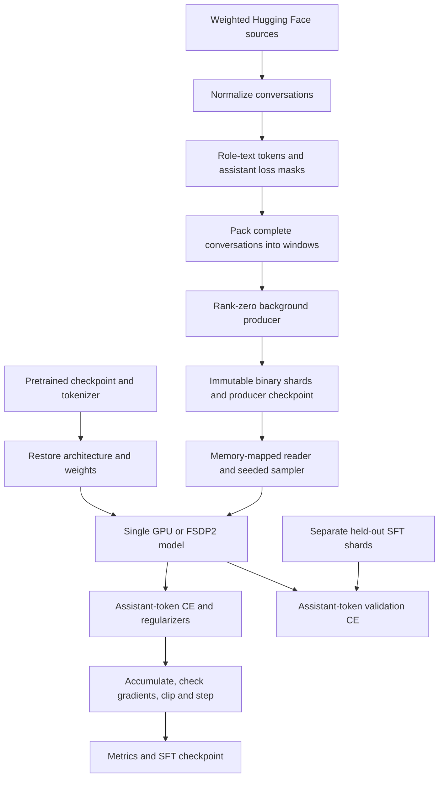

# Supervised post-training

This folder turns a pretrained `HybridForCausalLM` checkpoint into an instruction-following model through supervised fine-tuning (SFT). It provides single-GPU and FSDP2 entry points using the weighted conversation pipeline in [`utils/sft_dataset.py`](../utils/sft_dataset.py).

The implementation supports full-parameter SFT. Preference optimization, reinforcement learning, and adapter-only training are outside these entry points.

## Entry points

| File | Responsibility |
| --- | --- |
| [`sft_post_train.py`](sft_post_train.py) | Single-GPU training and the shared SFT loop, data feed, validation, and checkpoint handling. Reuses helpers from [`train.py`](../train.py). |
| [`sft_fsdp2_post_train.py`](sft_fsdp2_post_train.py) | Distributed backend launched with `torchrun`. Reuses FSDP2 and optimizer helpers from [`pre-training/fsdp2_train.py`](../pre-training/fsdp2_train.py). |
| [`../utils/sft_dataset.py`](../utils/sft_dataset.py) | Source configuration, conversation normalization, tokenization, assistant loss masks, binary shard production, and memory-mapped consumption. |
| [`../utils/fsdp2_muon.py`](../utils/fsdp2_muon.py) | DTensor-aware Muon used by the distributed optimizer. |

Run the commands below from the **repository root**. Commands are written on one line so they also work in PowerShell.

## Before starting

Use Python 3.11 or newer and install the training dependencies in [`requirements.txt`](../requirements.txt):

```text
python -m pip install -r requirements.txt
```

For the repository's pinned FSDP2 baseline, see [`requirements-fsdp2.txt`](../requirements-fsdp2.txt) and the [distributed setup notes](../README.md#9-training-infrastructure--distributed-execution). The installed PyTorch CUDA build must work with the host driver. FSDP2 post-training requires CUDA even when `--dist-backend gloo` is selected.

Provide a repository checkpoint containing `config` and `model_state_dict`. A checkpoint argument can name the `.pth` file or its directory; directory arguments resolve to `model_ckpt.pth`. The scripts do not load arbitrary Hugging Face model directories or sharded DCP directories.

Use the **same tokenizer as pretraining**. The default is `UIC-AI-lab/llama2-tokenizer`; override `--tokenizer-name` when needed. Startup checks its vocabulary against the saved embedding size and verifies the BOS/EOS IDs. These checks do not prove that two different tokenizers have the same token-to-ID mapping.

Choose dedicated run and cache directories. Online production needs access to the configured Hugging Face sources, including any required account access. Existing Hugging Face authentication is used by the data libraries.

### Context length comes from the checkpoint

`--seq-len` is the number of input tokens presented to the model. It defaults to the saved `max_position_embeddings` and cannot exceed that value. The SFT producer and reader use storage windows of **`seq_len + 1`** tokens because the labels are shifted by one position.

For example, `--seq-len 4096` uses 4097-token storage windows. A manually supplied `--tokens-per-shard` must be a positive multiple of 4097. If omitted, the trainer chooses:

```text
tokens_per_shard = (seq_len + 1) * max(32, batch_size * world_size)
```

**The default mixture includes long conversations that may exceed the pretrained model's context.** The producer raises on an oversized conversation; it does not silently truncate, split, or skip it. A 4096-token checkpoint cannot process every long-context source unchanged. Curate the source data to fit the model, or use a checkpoint already configured for the required context. Selecting a dataset by name alone does not guarantee that all its examples fit.

## Start a new SFT run

### Single GPU

```text
python post-training/sft_post_train.py --pretrained-checkpoint model_ckpt --run-dir runs/sft --cache-dir data_cache/sft --max-steps 1000 --batch-size 1 --grad-accum-steps 8 --lr 2e-5
```

This loads the saved architecture and weights, then starts fresh SFT optimizer and scheduler state at step zero. It does not continue the pretraining optimizer or data cursor. The checkpoint's regularizer settings are preserved unless explicitly overridden.

The single-GPU path uses the root trainer's Muon/AdamW parameter grouping. If the installed PyTorch lacks `torch.optim.Muon`, it logs a fallback to AdamW. `--no-muon` explicitly selects AdamW-only training.

### FSDP2 on multiple GPUs

```text
torchrun --standalone --nproc_per_node=4 post-training/sft_fsdp2_post_train.py --pretrained-checkpoint model_ckpt --run-dir runs/sft_fsdp2 --cache-dir data_cache/sft_fsdp2 --max-steps 1000 --batch-size 1 --grad-accum-steps 8 --lr 2e-5
```

`--nproc_per_node` must match the number of GPUs assigned to this run. For multi-node launches, configure `torchrun` rendezvous arguments for the cluster and make the checkpoint, run directory, and cache accessible at the same paths on every rank.

Batch size is **per rank**. For full accumulation windows:

```text
effective batch = batch_size * world_size * grad_accum_steps
```

The example above therefore processes 32 packed sequences per optimizer step. Partial accumulation windows at shard boundaries can be smaller.

### Resume SFT

```text
python post-training/sft_post_train.py --resume runs/sft/model_ckpt.pth --run-dir runs/sft --cache-dir data_cache/sft --max-steps 1000 --batch-size 1 --grad-accum-steps 8 --lr 2e-5
```

```text
torchrun --standalone --nproc_per_node=4 post-training/sft_fsdp2_post_train.py --resume runs/sft_fsdp2/model_ckpt.pth --run-dir runs/sft_fsdp2 --cache-dir data_cache/sft_fsdp2 --max-steps 1000 --batch-size 1 --grad-accum-steps 8 --lr 2e-5
```

Keep the original model, tokenizer, source configuration, resolved cache path, sequence/shard sizes, seed, batch/accumulation sizes, optimizer settings, precision settings, and schedule. Distributed resumes also require the same trainer family and world size. Pass any custom flags used by the original run again.

`--max-steps` is the original total schedule length, not a number of additional steps. Changing it causes a resume contract mismatch. To change topology or start a new schedule, use the SFT checkpoint as `--pretrained-checkpoint` with a fresh run/cache directory. That starts a new weights-only run and resets the data cursor.

## Data and training pipeline



### Default mixture

Weights are probabilities for sampling **normalized conversations**, not token percentages or guaranteed proportions in every batch. Sources within each topic share that topic's allocation equally. The two rStar SFT subsets share the single rStar source allocation.

| Topic | Weight | Sources |
| --- | ---: | --- |
| General instruction | 45% | `HuggingFaceTB/smoltalk` (`all`), `teknium/OpenHermes-2.5`, `OpenAssistant/oasst1`, `HuggingFaceH4/no_robots`, `allenai/WildChat`, `HuggingFaceH4/ultrachat_200k` (`train_sft`), `allenai/tulu-3-sft-mixture` |
| Coding | 15% | `nvidia/OpenCodeInstruct`, `ise-uiuc/Magicoder-OSS-Instruct-75K`, `microsoft/rStar-Coder` (`seed_sft`, `synthetic_sft`), `codeparrot/apps` |
| Math | 8% | `open-r1/OpenR1-Math-220k`, `open-r1/OpenThoughts-114k-math`, `nvidia/OpenMathInstruct-2`, `oumi-ai/MetaMathQA-R1`, `bespokelabs/Bespoke-Stratos-17k` |
| Science | 5% | `open-thoughts/OpenThoughts-114k`, `allenai/SciRIFF` (`4096`) |
| Tool use / agents | 8% | `open-thoughts/OpenThoughts-Agent-SFT-100K`, `Team-ACE/ToolACE`, `HuggingFaceTB/smoltalk` (`apigen-80k`) |
| Long context | 7% | `zai-org/LongAlign-10k` |
| Structured output | 5% | `HuggingFaceTB/smoltalk` (`apigen-80k`, `smol-constraints`), `Team-ACE/ToolACE` |
| Safety / refusal | 7% | `nvidia/Nemotron-SFT-Safety-v2` |
| **Total** | **100%** | |

These are source buckets, not mutually exclusive content classifications. Compilations overlap, OpenThoughts contains multiple domains, and ToolACE/APIGen intentionally appear in more than one bucket. No global deduplication or semantic topic filtering is performed. Interleaving uses a seeded `all_exhausted` strategy, which can repeat smaller sources while larger sources continue. Training stops at `--max-steps` or stream exhaustion; the CLI has no epoch-count option.

### Source normalization and formatting

The adapters handle role/content messages, ShareGPT-style `from`/`value` messages, and prompt/answer columns. OASST1's train rows are indexed in memory to reconstruct full conversation paths. APPS selects a nonempty solution and includes starter code without treating test-case metadata as the answer. The OpenThoughts math adapter retains rows marked correct. Nemotron is read as individual JSONL records to avoid decoding its heterogeneous unused metadata through Arrow.

Tool definitions, tool calls, identifiers, and tool observations remain part of the conversation. Empty/incomplete rows are filtered; schema errors and sources without valid conversations fail explicitly.

The serialization uses ordinary `role:\n` headers, an optional BOS at conversation start, and EOS after assistant messages. It does **not** apply a tokenizer-native chat template or add new role tokens. Assistant bodies, including serialized tool calls, and their EOS tokens receive labels. System, user, tool-observation, role-header, and padding positions receive `-100` labels. Preserve this formatting when preparing inference prompts; [`tokenize_messages`](../utils/sft_dataset.py) defines the exact encoding.

Complete conversations can share a packed window. They share causal attention and are not isolated by a block-diagonal attention mask. A conversation never crosses a storage-window boundary; unused space is padded. The reader returns already shifted `(input_ids, labels)` tensors, so the trainer must not shift labels again.

### Customize sources and sequence handling

`--dataset-config path/to/mix.json` replaces the default mixture with a JSON list using the source schema from `utils/sft_dataset.py`. Each weight must be positive and finite, and the weights must sum to one.

`--exclude-topics` allows excluding specific topics from the default mixture without writing a custom JSON file. The remaining topic weights are automatically re-normalized to sum to 1.0:
```text
# Exclude long_context for standard 4096-context training to avoid streaming 64k-token samples:
torchrun --standalone --nproc_per_node=2 post-training/sft_fsdp2_post_train.py \
    --pretrained-checkpoint model_ckpt --exclude-topics long_context
```

`--oversized-behavior {filter,truncate,error}` controls how conversations longer than `--seq-len` are handled:
* `filter` (default): Skips the conversation, logs progress, and continues without interrupting training. Recommended for robust training on open datasets.
* `truncate`: Truncates tokens and loss mask to `seq_len` (skipping the sample if no supervised assistant tokens remain after truncation).
* `error`: Raises an explicit `ValueError` (legacy behavior).

For example, this is a **replacement general-instruction mix**, not the eight-topic default:

```json
[
  {"path": "HuggingFaceH4/no_robots", "name": null, "split": "train", "text_col": "messages", "topic": "general", "weight": 0.5},
  {"path": "HuggingFaceH4/ultrachat_200k", "name": null, "split": "train_sft", "text_col": "messages", "topic": "general", "weight": 0.5}
]
```

Preserve adapter-specific fields when editing the full mixture. `get_dataset_configs()` returns an independently editable copy. Source revisions should remain unchanged during a run; deterministic replay also depends on the underlying data remaining stable.

## Optimization and distribution

Cross-entropy is weighted by the number of supervised assistant tokens across all microbatches and ranks in an optimizer step. This prevents short answers and heavily masked batches from receiving disproportionate weight. Auxiliary regularizers are averaged across microbatches separately. Non-finite loss or gradient norms abort the update.

Both paths keep FP32 master parameters and use BF16 autocast on CUDA unless `--no-amp` is set. Gradient checkpointing defaults to non-reentrant recomputation. Training disables inference caches and compilation; memory/SSM auxiliary-loss settings are inherited from the checkpoint unless overridden.

The FSDP2 backend shards layers before the root and builds optimizers afterward. It preserves the pretraining implementation's replicated custom-math parameters, manually averages their gradients, and uses clipping that accounts for both sharded and replicated parameters. Muon orthogonalizes complete gathered momentum matrices; `--muon-gather-buffer-mb` bounds its gathered working set. AdamW handles the remaining parameters.

Per-rank sampling is deterministic for a given seed and shard index. Distributed sampling drops the global remainder needed to give ranks equal sample counts; the DataLoader can still yield a smaller final microbatch. Ranks therefore execute matching accumulation/collective sequences.

Initialization materializes a full model on each GPU before sharding. Checkpoints consolidate model/optimizer state rather than writing sharded DCP files. Budget for these memory peaks; this implementation does not use meta-device initialization or elastic resume.

## Shards, checkpoints, and outputs

```text
runs/sft/
  model_ckpt.pth       # Latest model, optimizer, scheduler, RNG and batch cursor
  config.json          # Saved model configuration
  sft_config.json      # Resolved SFT runtime contract
  train.log            # Startup, progress, validation and failure diagnostics
  metrics.jsonl        # Logged training CE, assistant-token count, norm and LRs

data_cache/sft/
  producer_state.json  # Stream position and buffered tokens/masks
  shard_000000.bin     # Little-endian uint32 tokens
  shard_000000.mask    # uint8 assistant loss mask
  shard_000000.json    # Format, storage window and token-count metadata
  ...
```

The producer publishes `.bin` last, after the mask and metadata are ready. The training feed bounds read-ahead with `--max-buffered-files` but **retains consumed shards on disk**. This lets a model checkpoint resume even when the producer has advanced further. The trainer does not use the standalone producer's `.done` deletion protocol. Disk use grows with the retained dataset.

Keep both the cache and run checkpoint. Do not mix pretraining uint16 shards with SFT uint32/mask shards, modify published shards, or share a writable cache between independent runs. Interrupted publication is handled by replaying and checking existing shard contents before advancing the producer state.

Model checkpoints are saved at `--save-interval` optimizer steps and on normal completion. Exceptions do not create a new model checkpoint; recovery starts at the latest completed save. Producer resumption replays and skips normalized conversations, with O(N) startup cost. It is not native constant-time stream restoration.

### Offline shards

Add `--offline-shards` to consume a previously prepared cache without launching the producer. It must contain contiguous SFT shards starting at `shard_000000.bin`, with matching `.mask`/`.json` companions, the same tokenizer, and the expected storage-window length. The tokenizer is still loaded; for a disconnected run it must be available locally or in the Hugging Face cache.

### Held-out validation

Prepare a separate held-out directory using the SFT shard format and the same tokenizer/window length, then add:

```text
--validation-dir data_cache/sft_validation --val-interval 100 --val-batches 20
```

The scripts do not create a validation split automatically. Choose held-out source rows before producing these shards. Validation reports assistant-token cross-entropy in `train.log` and restores training mode afterward. FSDP2 ranks evaluate identical batches to keep forward collectives aligned, even for small held-out sets. Validation is disabled when no directory is supplied.

## Main options

| Option | Default | Meaning |
| --- | --- | --- |
| `--max-steps` | `1000` | Total optimizer-step schedule length. |
| `--batch-size` / `--grad-accum-steps` | `1` / `8` | Per-rank microbatch size and accumulation window. |
| `--lr` | `2e-5` | Shared peak learning rate; `--muon-lr` and `--adam-lr` override each optimizer. |
| `--warmup-steps` / `--min-lr-ratio` | `30` / `0.1` | Linear warmup and cosine-schedule floor. |
| `--weight-decay` / `--max-grad-norm` | `0.01` / `1.0` | Weight decay and global gradient clipping. |
| `--gradient-checkpointing` | Enabled | Disable with `--no-gradient-checkpointing`. |
| `--auxiliary-losses` | Inherited | Explicitly enable or disable with `--no-auxiliary-losses`. |
| `--no-amp` / `--no-fused-mamba` | Unset | Disable BF16 autocast or fused Mamba kernels. |
| `--no-muon` | Unset | Use AdamW only. |
| `--muon-gather-buffer-mb` | `64` | Distributed Muon gathered working-set cap in MiB. |
| `--max-buffered-files` / `--shard-timeout` | `3` / `1800` | Read-ahead limit and shard wait timeout in seconds. |
| `--save-interval` / `--log-interval` | `100` / `10` | Checkpoint and training-log intervals. |
| `--seed` | `42` | Training and source/sampler seed. |

See both CLIs for all options:

```text
python post-training/sft_post_train.py --help
python post-training/sft_fsdp2_post_train.py --help
```

## Troubleshooting and verification

| Symptom | Check |
| --- | --- |
| Conversation exceeds `seq_len` | Curate examples to fit the checkpoint context; the trainer does not extend model context or truncate examples. |
| SFT resume contract mismatch | Restore the original launch settings, world size and resolved cache path, or start a fresh weights-only run. |
| Tokenizer vocabulary/BOS/EOS mismatch | Supply the original pretraining tokenizer. |
| Missing, unaligned or wrong-format shards | Use the SFT reader and complete companion files with storage windows of `--seq-len + 1`. |
| No trainable batches | Check that the cache has data and that distributed shards have enough sequences for the world size. |
| Source failure or shard timeout | Read `train.log` for the source/schema/access error; increasing a timeout does not fix a schema error. |
| CUDA unavailable | Check the host's PyTorch/driver setup. Single-process CPU smoke tests can use `--device cpu --no-amp`; FSDP2 requires CUDA. |

Run the focused tests and repository checks from the root:

```text
python -m unittest tests.test_sft_dataset tests.test_sft_post_train -v
ruff check .
ruff format --check .
git diff --check
```

The tests cover source adapters, masking, shard integrity, deterministic replay, real CPU SFT updates, interrupted model resumes, token-weighted loss, sampler partitioning, validation, and FSDP2 helper wiring. The implementation was also checked with the model and existing FSDP2 regression suites. Multi-GPU SFT execution and full-corpus processing have not been verified by these CPU tests.
